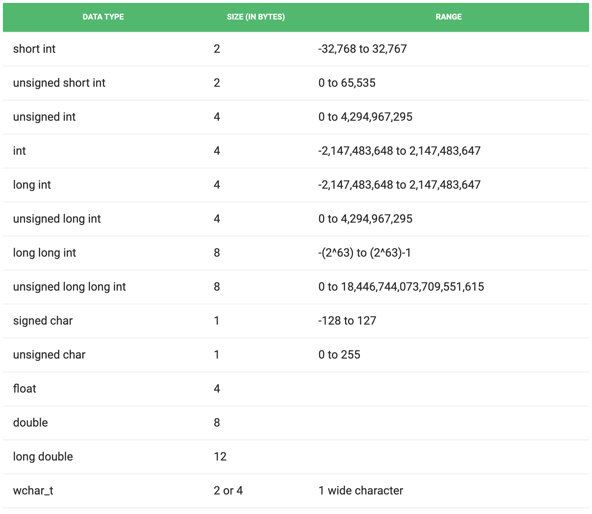
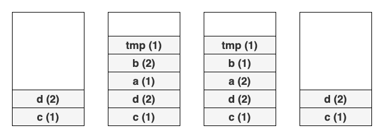
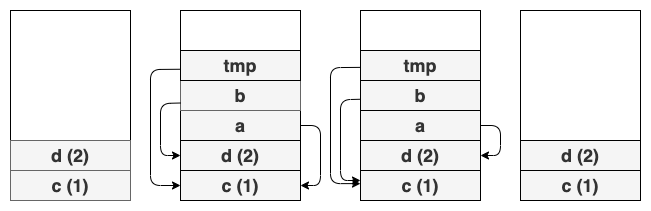
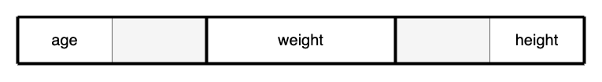
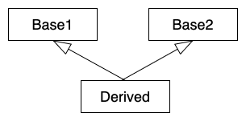
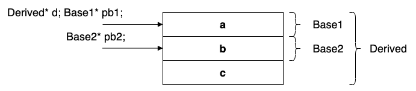
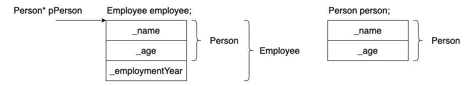

__"C makes it easy to shoot yourself in the foot; <br>
C++ makes it harder, but when you do it, it blows your whole leg off."__

~ _Bjarne Stroustrup_ ~


## Bevezetés


A __C++__ egy általános célú, magas szintű programozási nyelv. Gyakori tévhit, hogy alacsony szintű (hardver közeli). Noha lehetőséget biztosít arra, hogy alacsony szinten programozzunk, számos absztrakciós lehetőséget tartalmaz. Támogatja a __procedurális__, __objektumorientált__ és a __generikus programozást__ valamint az __adatabsztrakciót__. Legtöbb nyelvhez képest abban emelkedik ki, hogy az itt megvalósított absztrakcióknak ritkán van futási idejű költsége.

__Érdekesség__: [Andrei Alexandrescu](https://en.wikipedia.org/wiki/Andrei_Alexandrescu) azt nyilatkozta, hogy amikor a Facebook-nak a back-end kódján 1%-ot sikerült optimalizálnia, több mint 10 évnyi fizetését spórolta meg a cégnek havonta csak az áramköltségen.

A C++ nyelv fejlesztését még a '80-as években [Bjarne Stroustrup](https://hu.wikipedia.org/wiki/Bjarne_Stroustrup) kezdte el a C programozási nyelv kiterjesztéseként, más nyelvekből véve át megoldásokat. Az első hivatalos szabványa a nyelvnek 1998-ban jelent meg. Alapvetően a nyelv két összetevőből áll. Az aktuális szabványból és annak implementációjából. A szabvány az, ami meghatározza a nyelv nyelvtanját, valamint a szemantikáját (mit jelentenek a leforduló programok).

Eddigi C++ szabványok:

* C++98
* C++03
* C++11
* C++14
* C++17
* (C++2a) (Egyelőre még nem hivatalos ezért is a 2a nevet kapta, de 2020-ban várható)

A szabvány nevében a számok a szabvány elfogadásának évét jelentik.

Számos fordító létezik a C++ kódok fordítására, amelyek különböző mértékben támogatják az aktuális C++ szabványt:

* MSVC
* GCC
* Clang


### C++ filozófia


A C++ filozófiájának fontos eleme, hogy ha nem használunk egy adott nyelvi eszközt, akkor annak ne legyen negatív hatása a program teljesítményre. Magyarán mondva csak azért "fizessünk", amit használunk is. Fontos megjegyezni, hogy a C++ alapvetően nem objektumorientált nyelv. Ahogy fentebb olvashattuk, kíválóan alkalmas mas programozási paradigmák használatára is. A nyelv nem próbál meg ráerőltetni a programozóra egy megközelítést, ellenben próbál minél gazdagabb eszköztárat biztosítani, hogy a megfelelő problémát a megfelelő megközelítéssel lehessen megoldani. Még akkor is, ha ez a különböző paradigmák keverését vonja maga után. Ezért a nyelvet gyakran multiparadigmás programozási nyelvnek is szokás nevezni.


## Alapok


### C++ adattípusok


A C++ szigorúan típusos nyelv, ami azt jelenti, hogy már fordítási időben ismert kell a változók típusát. Az összes változó adattípust használ a deklaráció során a tárolni kívánt adatok típusának korlátozására. Ezért azt mondhatjuk, hogy az adattípusokat arra használják, hogy megmondják a változóknak, hogy milyen típusú adatot tárolhatnak. Ha egy változót a C++-ban definiálnak, a fordító memóriát allokál ehhez a változóhoz azon adattípus alapján, amellyel azt deklarálják. Minden adattípushoz eltérő mennyiségű memória szükséges.

Adattípusok C++-ban:

* __Primitív__: ezek az adattípusok beépített vagy előre meghatározott adattípusok, és a felhasználó közvetlenül felhasználhatja a változók deklarálására. példa: ```int```, ```char```, ```float```, ```bool``` stb. A C++-ban rendelkezésre álló primitív adattípusok a következők:
	* __Integer__ (```int```): az egész számok tárolására használják. Általában __4 bájt__ memóriahelyet igényelnek, és -2147483648-tól 2147483647-ig terjednek.
	* __Character__ (```char```): karakterek tárolására szolgál. A karakterek általában __1 bájt__ memóriahelyet igényelnek, és -128 és 127 vagy 0 és 255 között változhatnak.
	* __Boolean__ ```bool```: logikai értékek tárolására szolgál. A logikai változó igaz (```true```) vagy hamis (```false```) értékeket tárolhat.
	* __Floating point__ (```float```): egyszeri pontosságú (__single precision__) tizedes értékek tárolására szolgál. Általában __4 bájt__ memóriahelyet igényelnek. 1 bit az előjelnek, 8 bit a szám egész részének és 23 bit a tizedes résznek van fenntartva, azaz 7 tizedesjegy pontossággal képes tárolni az adatokat.
	* __Double floating point__ (```double```): dupla pontosságú (__double precision__) tizedes értékek tárolására szolgál. Általában __8 bájt__ memóriahelyet igényelnek. 1 bit az előjelnek, 11 bit a szám egész részének és 52 bit a tizedes résznek van fenntartva, azaz 15 tizedesjegyig képes tárolni az adatokat.
	* __Void__ (```void```): azt jelenti: érték nélkül. A ```void``` adattípus értéktelen entitást jelent. Azoknál a függvényeknél használják, amelyek nem adnak vissza értéket.
	* __Wide character__ (```wchar_t```): szintén egy karakter adattípus, de ennek az adattípusnak a mérete meghaladja a normál 8 bites adattípust. Általában __2 vagy 4 bájt__ hosszú.
* __Származtatott__: a primitív vagy beépített adattípusokból származó adattípusokat származtatott adattípusoknak nevezzük. Ezek négyféle lehetnek, nevezetesen:
	* __Function__
	* __Array__
	* __Pointer__
	* __Reference__
* __Felhasználó által definiált__: ezeket az adattípusokat maga a felhasználó határozza meg. Például egy osztály  vagy egy struktúra meghatározása a C++-ban. A C++ a következő felhasználó által definiált adattípusokat tartalmazza:
	* __class__
	* __structure__
	* __union__
	* __enum__
	* __typedef__

A primitív típusok méretének megadásánál azért szerepel mindenhol az _általában_, mert a C++ szabvány nem határozza meg pontosan az egyszerű típusok méretét, így azok fordítótól és hardverkörnyezettől függően eltérőek lehetnek különböző rendszereken. A rendszerünkön érvényes méreteket, tartományokat a ```sizeof()``` operátorral tudjuk meghatározni. 
A ```sizeof()``` operátor megadja a paraméterként megkapott típus, vagy objektum esetében annak típusának méretét. Mindenesetre abban biztosak lehetünk, hogy ezek a megkötések minden rendszeren érvényesek C++-ban:

* ```1``` == ```sizeof(char)``` <= ```sizeof(short int)``` <= ```sizeof(int)``` <= ```sizeof(long int)```
* ```1``` <= ```sizeof(bool)``` <= ```sizeof(long int)```
* ```sizeof(char)``` <= ```sizeof(wchar_t)``` <= ```sizeof(long int)``` <= ```sizeof(long long int)```
* ```sizeof(float)``` <= ```sizeof(double)``` <= ```sizeof(long double)```
* ```sizeof(int)``` == ```sizeof(signed int)``` == ```sizeof(unsigned int)``` és ugyanez ```short int```, ```long int```, valamint ```long long int``` esetén is érvényes.

Fontos megjegyezni, hogy az ```1``` == ```sizeof(char)``` kifejezésben az 1 nem feltétlenül 1 bájtot jelent, hanem egy egységet, ami bizonyos rendszereken lehet például 2 vagy 4 bájt.

__Megjegyzés__: a ```sizeof(type)``` kifejezés helyett használható a ```std::numeric_limits<type>::digits```. Ennek használatához azonban szükség van a ```<limits>``` header include-olására.


### Adattípus módosítók


Ahogy a neve is mutatja, az adattípus-módosítókat a beépített adattípusokkal használják az adatok hosszának módosítására, amelyet egy adott adattípus képes tárolni.

__előjeles__ (signed)

* integer
* char
* long - prefix

__előjel nélküli__ (unsigned)

* integer
* char
* short - prefix

__long__

* integer
* double  

__short__

* integer




## Fordító működése, fordítás parancssori eszközökkel, több forrásfájl, object, linkelés


A fordítás 3 fő lépésből áll:

* __Preprocesszálás__ (_előfeldolgozás_)
* __Fordítás__ (_tárgykód létrehozása_)
* __Linkelés__ (_szerkesztés_)

A fordítás a __preprocesszor__ parancsok végrehajtásával kezdődik, mint például a __header__ fájlok beillesztése a ```.cpp``` fájlokba, az így kapott fájlokat hívjuk __fordítási egységeknek__ (_translation unit_). A fordítási egységek külön-külön fordulnak __tárgykóddá__ (_object file_). Ezekben a gépi utasítások már megvannak, de hiányoznak belőle a hivatkozások, például változók vagy függvények, melyek más fájlokban vannak megvalósítva. Ahhoz, hogy a tárgykódból __futtatható állományt__ (_executable file_) lehessen készíteni, össze kell linkelni őket. A __szerkesztő__ (_linker_) feladata, hogy kitöltse a tárgykódban hiányzó referenciákat. A linkelés lehet __statikus__, amikor a fordító tölti fel a hiányzó referenciákat, vagy __dinamikus__, amikor fordítási időben, jellemzően egy másik fájlból (pl: .dll) tölti be a hiányzó kódot. Utóbbi akkor praktikus, ha egy modult több, különálló program használ.


### Preprocesszálás


Az __előfeldolgozó__ (_preprocesszor_) használata a legtöbb esetben kerülendő. Ez alól kivételek a __header__ állományok ```include```-olása. A preprocesszor primitív szabályok alapján dolgozik és __nyelvfüggetlen__. Mivel semmit nem tud a C++-ról, ezért sokszor meglepő viselkedést okoz a használata a fejlesztő számára. Emiatt nem egyszerű meghatározni az általa okozott hibákat. Továbbá az automatikus refaktoráló eszközök használatát is megnehezíti a túlzott használatuk.

A következőkben nézzünk meg pár preprocesszor direktívát. Minden direktíva ```#``` jellel kezdődik.

```cpp
#define NUMBER 5

// a #define NUMBER 5 parancs azt jelenti,
// hogy minden NUMBER szót ki kell cserélni a fájlban 5-re.

#ifdef NUMBER
  std::cout << "Is defined";
#else
  std::cout << "Not defined";
#endif
```

A fent leírtakon kívül a ```#define``` hatására a preprocesszor az első argumentumot defináltnak fogja tekinteni. A fenti kódban megvizsgáljuk, hogy a ```NUMBER``` makró definiálva van-e (```#ifndef``` parancs), és mivel ezt megtettük, az ```#else```-ig minden beillesztésre kerül.

```cpp
#define NUMBER
#undef NUMBER

#ifndef NUMBER
  std::cout << "Is defined";
#else
  std::cout << "Not defined";
#endif
```

Az ```#undef``` parancssal a paraméterként kapott makrót a preprocesszor nem tekinti továbbá makrónak.

Definiálni függvényeket is tudunk.

```cpp
#include <iostream>

#define MAX(x, y) (x > y ? x : y)

int main()
{
  std::cout << MAX(10, 12) << std::endl;
}
```

Látható, hogy a preprocesszort kódrészletek kivágására is lehet használni. Felmerülhet a kérdés, hogy ha az eredeti forrásszövegből a preprocesszor kivág, illetve beilleszt részleteket, akkor a fordító honnan tudja, hogy a hiba jelentésekor melyik sorra jelezze a hibát? Hiszen az előfeldolgozás előtti és utáni sorszámok egymáshoz képest eltérnek. Ennek a problémának a kiküszöbölése érdekében a preprocesszor beszúr sorokat a fordító számára, amik hordozzák azt az információt, hogy a feldolgozás előtt az adott sor melyik fájl hányadik sorában volt megtalálható. 

További indok a preprocesszor direktívák kerülésére, hogy gyakran nem azt a viselkedést produkálják amire számítunk. 

Tekintsük az alábbi kódrészletet:

```cpp
#include <iostream>

#define add(x, y) ((x+y) + (x+y))

int main()
{
  int i = 1;
  int j = 2;
  std::cout << add(++i,++j); // 12
  i = 1;
  j = 2;
  std::cout << add(++i,j++); // 10
  i = 1;
  j = 2;
  std::cout << add(i++,j++); // 8
}
```

> kimenet: 12 10 8

Rekurzív ```include```-oknál a preprocesszor egy bizonyos mélységi limit után leállítja az előfeldolgozást. Ezt egy trükk segítségével megakadályozhatjuk, hogy ugyan az a fájl többször is beillesztésre kerüljön többszörös include esetén.

```cpp
#ifndef __H_HPP__
#define __H_HPP__
  SYMBOL
#endif

#include "h.hpp"
#include "h.hpp"
#include "h.hpp"
#include "h.hpp"
```

Ellenőrizzük, hogy a ```__H_HPP__``` szimbólum definiálva van-e. Ha nincs, akkor definiáljuk. A második ```#include "h.hpp"```-nál nem fogjuk újra beilleszteni a ```SYMBOL```-t, mert az ```#ifndef __H_HPP__``` kivágja azt a szövegrészt, mivel már egyszer definiálásra került. Ez az úgynevezett __header guard__ vagy __include guard__ technológia. Megvédi a header-t a többszörös include-tól.

A fenti kódban látható makrók használata olyan kockázattal jár, hogy névbeli konfliktusok léphetnek a használt makrók kapcsán, de a fordítónak semmi fogalma sincs a programozó szándékáról, ezért néha nem képes optimalizálni a viselkedést. Van azonban egy ```#pragma once``` nevezetű makró, amelyet a modern fordítók támogatnak és amelynek a célja az volt, hogy megakadályozza a header-ök többszöri beillesztését egy fordítási egységbe. A fordítók ezt nagyon hatékony és biztonságos módon valósítják meg. Felgyorsítja a fordítási időt, különösen nagy projektek esetén, és elkerüli a névütközések konfliktusának kockázatát. 

```cpp
#pragma once

// program kód
```

* Olvashatóbbá teszi a kódot a felesleges kódsorok elhagyásával.
* Elkerüli a névütközéseket más könyvtárakkal és fejlécekkel.
* Felgyorsítja a fordítási időt.

__Megjegyzés__: C-ben a globális konstansok definiálására használták a makrókat. Ez C++-ban kerülendő. Használjuk a ```const``` kulcsszót és a változóinkat kössük minél jobban ahhoz a scope-hoz amelybe tartoznak.


### Linkelés


Tekintsük az alábbi fordítási egységeket:

```cpp
// symbol.cpp
void symbol() {}

// main.cpp
int main() { symbol(); }
```

Fordítsuk le őket az alábbi sorrendben:

> $ clang++ main.cpp

> $ clang++ symbol.cpp

__Megjegyzés__: ```clang++``` helyett használhatjuk a ```g++```-t is, ami nem összekeverendő a ```gcc```-vel, ami __C__ fájlok fordítására alkalmas.

Fordítási hibát fogunk kapni, hiszen vagy csak a ```main.cpp```-ből létrejövő fordítási egységet, vagy a ```symbol.cpp```-ből létrejövő fordítási egységet fogja látni a fordító, egyszerre a kettőt nem. Megoldás az, ha __forward deklarálunk__, azaz ```void symbol();```-t beillesztjün a ```main()``` függvény elé, mely jelzi a fordítónak, hogy a ```symbol()``` az egy függvény, visszatérési értékének a típusa ```void``` (azaz nem ad vissza semmit) és nincs paramétere.

```cpp
// symbol.cpp
void symbol() {}

// main.cpp
void symbol(); // forward deklaráció

int main() { symbol(); }
```

A fodítás során a linkelés fázisánál kapunk hibát, mert a linker nem fogja megtalálni a ```void symbol()``` függvény definícióját. Ezt úgy tudjuk megoldani, ha a ```main.cpp```-ből és a ```symbol.cpp```-ből először tárgykódot készítünk, majd később összelinkeljük őket. Ekkor a  ```main.cpp```-ben lesz egy hivatkozás a ```void symbol();``` függvényre, és a ```symbol.cpp``` fogja tartalmazni a függvény definícióját.

> $ clang++ -c main.cpp

> $ clang++ -c symbol.cpp

A ```-c``` (compile) kapcsoló segítségével jelezzük a fordító számára, hogy még ne linkeljek csak a tárgykódot állítsa elő. Majd a 

> $ clang++ main.o symbol.o

parancs segítségével az eredményül kapott tárgykódot tudjuk össze linkelni.

Rövidebb, ha egyből a ```.cpp``` fájlokat adjuk meg a fordítónak.

> $ clang++ main.cpp symbol.cpp

Egy adott függvényt (objektumot, osztályt) akárhányszor deklarálhatunk, azonban, ha a deklarációk ellentmondanak egymásnak, akkor fordítási hibát kapunk. Definiálni viszont a legtöbb esetben pontosan egyszer szabad. Több definíció, vagy épp a definíció hiánya problémát okozhat. Ezt az elvet szokás __One Definition Rule__-nak vagy röviden __ODR__-nek nevezni.

Ha egy ```.cpp```-ben több függvény is van, akkor nem célszerű ezeket egyesével forward deklarálni minden egyes fájlban, ahol használni szeretnénk. Ennél egyszerűbb egy header fájl megírása, amiben deklaráljuk a függvényünket.

```cpp
// symbol.hpp
#ifndef _SYMBOL_H_
#define _SYMBOL_H_
  void symbol();
#endif
```

Ilyenkor elég a ```symbol.hpp```-t include-olni. Szokás a ```symbol.hpp```-t a ```symbol.cpp```-ben is include-olni, mert ha véletlenül ellent mondana egymásnak a definíció a ```cpp``` fájlban és a deklaráció a ```hpp``` fájlban, akkor a fordító hibát fog jelezni (pl.: eltérő visszatérési érteket adunk meg).

Tekintsük az alábbi kódrészletet:

```cpp
// symbol.hpp
#ifndef _SYMBOL_H_
#define _SYMBOL_H_
  void symbol() {}
#endif
```

Abban az esetben, ha több fordítási egységből álló programot fordítunk, melyek tartalmazzák a ```symbol.hpp``` header-t, akkor a preprocesszor több ```symbol()``` függvény definíciót csinál és linkeléskor a linker azt látja, hogy egy függvény többször van definiálva, és ez linkelési hibához vezet, ugyanis a fordító nem fogja tudni eldönteni determinisztikusan, hogy melyiket is kellene használnia.

__Megjegyzés__: header fájlokban általában nem szabad definíciót írni, kivételek lehetnek a __template__ és az __inline__ függvények.


Hasznos kapcsolók fordításnál:

* ```-Wall -Wextra``` - warningok megjelnítése
* ```-std=c++xx``` - xx helyett bármelyik C++ szabvány szám elfogadott [98, 03, 11, 13, 17, 2a]
* ```-fsanitize=address``` - létrehoz ellenőrzéseket, amik azelőtt észrevesznek bizonyos nem definiált viselkedéseket, mielőtt azok megtörténnek.
* ```-O2``` - kettes szintű optimalizációt kapcsolja be. Alapértelmezetten nincs bekapcsolva (```-O0```), egészen ```-O3```-ig lehet fokozni.


### A C++ nyelvi elemei


Minden C++ kód tokenekből áll. A token a legkisebb nyelvi egység, ami még értelmes a fordító számára. Tokeneknek az alábbiakat tekntjük:

* __Kulcsszavak__: _int_, _return_
* __Azonosítók__: _number_ - lényegében azok a nevek, melyeket mi hozunk létre. Függvények, osztályok, változók nevei. Ez csak betűkből és számokból állhat, nem kezdődhet számmal es nem lehet kulcsszó. Fontos megjegyezni, hogy a C++ nyelv különbséget tesz kis- és nagybetűk között (case sensitive).
* __Literálok__:
	* egész számliterálok: 0xa23
	* karakterliterálok: 'a'
	* lebegőpontos számliterálok: 0.12
	* konstans szövegliterálok: "Hello"
* __Operátorok__: ```<<```, ```::```
* __Szeparátorok__: ```;```, ```{```, ```}```


## Viselkedések kategorizálása C++-ban


Reménytelen megközelítés lenne a szabványban minden szintaktikusan (nyelvtanilag) helyes kódhoz pontos szemantikát (működést) adni. Ezért a C++ szabvány néhány esetben nem, vagy csak részben definiálja egy adott program működését.


### Nem definiált viselkedés


```cpp
int main()
{
  int i = 0;
  std::cout << ++i << i++ << std::endl;
}
```

Fordítás és futtatás után különböző fordítókkal különböző eredményeket kaphatunk. Az, hogy mikor értékelődik ki a ```++i``` és az ```i++``` a kifejezésen belül, __nem specifikált__. Amikor a szabvány nem tér ki arra, hogy pontosan milyen viselkedésű kódot generáljon a fordító, akkor a fordító bármit választhat. Ez többek között lehetőséget ad a fordítónak arra, hogy __optimalizáljon__.

A C++-ban vannak úgynevezett __szekvenciapontok__. A szabvány annyit mond ki, hogy a szekvenciapot előtti kód hamarabb kerül kiértékelésre, mint az utána levő. Mivel itt az ```i``` értékadása után és csak az ```std::endl``` után van szekvenciapont, így az, hogy milyen sorrendben történjen a kettő közötti kifejezés részkifejezéseinek a kiértékelése,a fordítóra van bízva.

A C++-ban nem meghatározott, hogy két szekvenciapont között mi a kifejezések és részkifejezések kiértékelésének a sorrendje. Az adatfüggőségek azonban definiálnak egy sorrendet.

```cpp
int main() { std::cout << f(); }
```

Bár a fenti kódban csak az ```f()``` meghívása után található szekvenciapont, a függvény eredményének a kiírása előtt ki kell számolni az eredményét, különben nem tudnánk, hogy mit írjunk ki. Tehát a fenti kódban garantált, hogy az ```f()``` az eredmény kiírása előtt fog lefutni.

Az, hogy két részkifejezés szekvenciaponttal történő elválasztása nélkül ugyanazt a memóriaterületet módosítja, __nem definiált__ viselkedést eredményez. Ilyenkor a fordító vagy a futó program bármit csinálhat. A szabvány semmiféle megkötést nem tesz. 

__Megjegyzés__: az a program, amely nem definiált viselkedéseket tartalmaz, __HIBÁS__.


### Nem specifikált viselkedés


Amennyiben a szabvány definiál néhány lehetséges opciót, de a fordítóra bízza, hogy az melyiket választja, akkor __nem specifikált__ viselkedésről beszélünk. A nem specifikált viselkedés csak akkor probléma, ha a program végeredményét befolyásolhatja a forídtó választása.

```cpp
int main()
{
  int i = 0;
  int j = 0;
  std::cout << ++i << ++j << std::endl;
}
```

> kimenet: 11

Bár azt továbbra se tudjuk, hogy a ```++i``` vagy a ```++j``` értékelődik ki előbb (_nem specifikált_), azt biztosan tudjuk, hogy 11-et fog kiírni (a program végeredménye _jól definiált_).


### Implementáció által definiált viselkedés


A szabvány nem köti meg, hogy egy ```int``` egy adott platformon mennyi bájtból álljon. Ez állandó, egy adott platformon egy adott fordító mindig ugyanakkorát hoz létre, de platform/fordító váltás esetén ez változhat. Ennek az az oka, hogy különböző platformokon különböző választás eredményez hatékony programokat. Ennek köszönhetően hatékony kódot tud generálni a fordító, viszont a fejlesztő dolga, hogy megbizonyosodjon róla, hogy az adott platformon a primitív típusok méretei megfelelnek a program által elvárt követelményeknek.


# Első C++ program


Ezen információk tudatában megnézhetjük az első C++ programunkat. Tekintsük az alábbi kódot. A forrásfájl neve legyen ```main.cpp```:

```cpp
#include <iostream>

using namespace std;

int main(int argc, const char* argv[]) 
{ 
  cout << "Hello World!" << endl;
  return 0;
}
```

A _main.cpp_ meghatároz egy __fordítási egységet__ (_compilation unit_). A fordítás folyamata során fordítási egységeket fordítunk gépi kódra. Egy fordítási egységben az a kód található, amelyhez a fordító a fordítás során hozzáfér.

A kód legfelső sorában található az ```#include <iostream>```. A kettős kereszttel (```#```) jelzett sorok az __előfordítónak__ (_precompiler_) szóló utasítások. Ezek a már korábban említett  preprocesszor direktívák. Az ```include``` utasítás behelyettesíti a hívás helyére a megadott fájl tartalmát. Ez a helyettesítés __fordítási időben__ történik. 

Az ```iostream``` fejállomány (_header file_ vagy egyszerűen csak _header_) tartalmazza a megfelelő I/O (Input/Output) utasításokat a kiíratáshoz. Ez maga is ugyanúgy C++ kódot tartalmaz, melyet mi magunk is írunk. Két különböző elérési útvonallal tudjuk megadni az include-okat:

* ```#include <...> // előre bekonfigurált útvonalban keresi a fájlt```
* ```#include "..." // az útvonal relatív az aktuális fájlokhoz képest```


## Mik az előnyei az ```iostream```-nek a ```cstdio```-val szemben C++-ban?


Típusbiztonságot növel, csökkenti a hiba lehetőségek számát, lehetővé teszi a bővíthetőséget és az örökölhetőséget. A ```printf()``` vitathatatlanul jól működik és a ```scanf()``` is működik annak ellenére, hogy nem túl nagy a hibatűrő képessége. Mindazon által mindkettő korlátozzott a C++ I/O-val szemben. Ha szeretnénk összehasonlítani a C++ I/O ```<<``` és ```>>``` operátorai nagyjából megfelelnek a C ```printf()``` és ```scanf()``` függvényeinek. Azonban több előnyük is van ezekkel a függvényekkel szemben:

* __Típus biztosabb__: az ```<iostream>``` esetén az objektumok típusai fordítási időben ismertek a fordító számára. Ezzel szemben a ```<cstdio>``` ```%``` mezőket használ a típusok dinamikus meghatározásához.
* __Kevesebb hibalehetőség__: az ```<iostream>``` használatakor nincsenek redundáns ```%``` tokenek, amelyeknek konzisztensnek kell lenniük az I/O-zni kívánt objektumokkal. Ezen redundancia eltávolítása a hibák eltávolítását is jelenti.
* __Bővíthető__: a C++ ```<iostream>``` lehetővé teszi az új, felhasználó által definiált típusok I/O-zását, anélkül, hogy bármi problémát okozna a már meglévő kódban.
* __Örököltethető__: A C++ ```<iostream>``` mechanizmus olyan valós osztályokból épül fel, mint az ```std::ostream``` vagy az ```std::istream```. A ```<cstdio> FILE*```-al ellentétben ezek valódi osztályok, ezért örököltethetőek. Ez azt jelenti, hogy más felhasználók által definiált dolgok is viselkedhetnek __stream__-ként. Automatikusan használhatjuk a rengeteg soros I/O kódot, amelyet más felhasználók írtak, akik nem is tudják és nem is kell tudniuk a saját magunk által kiterjesztett __stream__ osztályról.


## Kiírás és beolvasás, C vs C++


C-ben a kiírásra és beolvasásra elsősorban a ```printf()``` és ```scanf()``` függvényeket használjuk. Ezekkel két fő probléma lehet:

* nincs típus ellenőrzés
* nem tudjuk megtanítani, hogyan kell a felhasználók által definiált típusokat kiírni illetve beolvasni.

A ```scanf()``` használatánál arra is oda kell figyelni, hogy cím szerint kell kapnia a változókat, könnyű a ```&``` karaktert lefelejteni, vagy olyankor is kitenni, amikor nincs rá szükség, pl. ```string```-eknél.

```c
#include <stdio.h>

int main()
{
  int a;
  scanf("%s", &a);
}
```

Ilyenkor a fordító nem ellenőrzi a paraméterek típusát, így lefordul a kód, pedig nyilvánvalóan helytelen. A ```scanf()``` ```string```-et fog beolvasni, ```char*``` paramétert vár és ```int*```-ot fog kapni egyetlen ```int```-nyi hellyel. Hosszabb ```string```-nél a kapott helyet túlírja és a következő memóriaterület sérül, vagy összeomlik a program. Az újabb fordítók erre már figyelmeztetést adnak.

Mindkét problémára megoldást nyújt a C++ megoldása. Kiíratásra az ```std::cout``` (C-ben az ```stdout```), beolvasásra az ```std::cin``` (C-ben az ```stdin```), míg hiba kezelésére a C-s ```stderr```-hez hasonlóan az ```std::cerr``` való. Használatukhoz az ```iostream``` header szükséges. Sor vége karakter kiírható akár az ```std::endl``` használatával is (kicsit bővebben az ```std::endl``` és a ```\n```-ről később).

Az ```std::cin``` a ```scanf()```-től eltérően képes referencia szerint átvenni a változókat, így nincs probléma a címképzéssel. Az ```std::cin```, ```std::cout``` és minden azonos típusú objektum automatikusan tud konvertálódni igaz vagy hamis logikai értékekre, attól függően, hogy volt-e hiba.

Mindezek az előnyök eltörpülnek amellett, hogy az ```std::cin``` és az ```std::cout``` megtanítható arra, hogyan kezelje a felhasználók által definiált típusokat.


## Névterek


A ```using namespace std;``` segítségével a standard névtér globális használatát tesszük lehetővé. Ennek hatására az ```std``` névtérben található típusok, függvények és változók oly módon is elérhetővé válnak, mintha a globális névtérben lettek volna deklarálva. A standard könyvtárban található implementációk az ```std``` névtérben találhatók. Ennek az az oka, hogy a standard könyvtár gazdag eszközkészletet biztosít, amelynek során számos gyakran használt nevet is felhasznál mint pl. ```find()```, ```max()``` stb. Ha nem az ```std``` névtérben lennének ezek a nevek, akkor bizonyos kontextusokban nem használhatnánk fel ezeket a neveket a saját programunkban. Éppen ezért gyakran kihagyjuk ezt a sort a programunkból. A standard könyvtárbeli elemekre minősített nevek megadásával hivatkozhatunk:

```cpp
#include <iostream>

int main(int argc, const char* argv[])
{
  std::cout << "Hello World!" << std::endl;
  return 0;
}
```

__FONTOS__: a ```using namespace ...;``` SOHA nem kerülhet header állományba. Ezzel ugyanis a header állomány összes felhasználójánál potenciálisan nevütközéseket okozunk. Fentebb explicit módon jeleztük a fordítónak, hogy az ```std``` névtérben keresse a ```cout``` és az ```endl``` változókat. 
 

### Névtelen névtér (_unnamed namespace_) 


Létezik úgynevezett __névtelen névtér__ (_unnamed namespace_), amit arra használhatunk, hogy ne szemeteljük tele a globális névteret, ezáltal megvédjük magunkat a többértelműségtől.
A modul szintű hatókörben a névtelen névterekben hozhatunk létre olyan változókat és függvényeket, amelyek a fordítási egységen kívül nem érhetőek el. Azonban a modulon belül minden korlátozás nélkül felhasználhatók a __hatókör operátor__ (_scope operátor_) ```::``` segítségével.

```cpp
namespace 
{
  int i = 0;
}

int main(int argc, const char* argv[])
{
  int i = ::i; // hivatkozunk a névtelen névtérben lévő i változóra
  return 0;
}
```


### Egymásba ágyazott névterek (_nested namespaces_)


A programozónak lehetősége van arra, hogy a névterekben újabb névtereket hozzon létre, vagyis egymásba ágyazza őket. Ezzel a megoldással a globális neveket is strukturált rendszerbe tudjuk szervezni.

```cpp
namespace A
{
  namespace B
  {
    int i = 0;
  }
}
```

Ebben az esetben az ```i``` változót a következő módon tudjuk elérni: ```A::B::i```. C++17 óta lehetőség van egymásba ágyazott névtereket egy rövidebb formában írni:

```cpp
A::B { int i = 0; }
```

A két kódrészlet funkcionalitásban teljesen megegyezik.


## A ```main()``` függvény


Ez a program __belépési pontja__ (_entry point_). Minden C++ nyelven írt programnak tartalmazni kell __PONTOSAN__ egyet. Ez az egyetlen olyan függvény, amit nem lehet túlterhelni. Paraméterei közül az ```argc``` a parancssori paraméterek számát adja meg, míg az ```argv[]``` egy nullpointerrel terminált, karaktermutatókat tartalmazó tömb, amelyben a parancssori paraméterek vannak C-stílusú string-ként. A C++-ban a tömböket 0-tól indexeljük, így az ```argv[]``` nulladik eleme a futtatható állomány neve, első eleme pedig az első paraméter.

```./program first second (vagy program.exe first second)```

```argv[0] == "program"```

```argv[1] == "first"```

```argv[2] == "second"```

A két kapcsos zárójel (```{ }```) közti részt blokknak nevezzük. A ```cout``` a C++ standard kimenete. Az ```endl``` pedig beilleszt egy newline karaktert a kiírandó sor végére. Felmerülhet a kérdés, hogy mi a különbség az ```endl``` és a ```\n``` között? Nos,

* a ```\n``` csak egy string aminek a hossza egy és ez adódik hozzá az ```std::cout```-hoz.
* az ```std::endl``` ezzel szemben egy objektum, ami a newline karakter hozzáadásához vezet ÉS ezek után flush-olja az ```std::cout``` buffert. Ezért ez több számítással jár. Az ```std::endl``` meghívja az ```os.put(os.widen('\n'))``` függvényt, majd ezt követően az ```os.flush()``` függvényt.

A ```return``` kulcsszó visszaadja a vezérlést az őt hívó függvénynek, jelen esetben ez a program befejezését jelenti, ezért az operációs rendszernek. A ```return``` mögé írt szám visszatérési értéke 0. Ez általában azt jelenti, hogy a program rendben lefutott. A ```main()```-ben ez nem kötelező, ha elhagyjuk, akkor automatikusan 0-t ad vissza, továbbá nem muszáj kiírni az ```int argc, const char* argv[]``` bemeneti paramétereket sem. A fordító ezeket automatikusan legenerálja. Ezért a következő program ekvivalens az előzőkkel:

```cpp
#include <iostream>

int main() { std::cout << "Hello World!" << std::endl; }
```

A __bitshift left__ operátor (```<<```) alternatív szintaxissal is meghívható:

```cpp
#include <iostream>

int main() { operator<<(std::cout, "Hello World!"); }
```

Ebből is látható hogy az operátorok tulajdonképpen függvények, tehát a szintaxisuktól eltekintve ugyanazon nyelvi szabályok fognak vonatkozni rájuk, mint a többi függvényre.

__Függvény deklarációnak__ nevezzük, amikor a függvény használatáról adunk információt. Ennek része a paraméterek típusa, visszatérési érték típusa és a függvény neve.

__Függvény definíciónak__ nevezzük azt, amikor leírjuk a függvény törzsét is, ezzel meghatározva, hogy mit csináljon. Ez egyben deklaráció is, hiszen a paraméterekről és visszatérési értékről is tartalmazza a szükséges információt.

Egy függvényhez több deklaráció is tartozhat, ha nem mondanak egymásnak ellent.

```cpp
int foo(); // deklaráció

int foo() // deklaráció és definíció
{
  std::cout << "Hello World!" << std::endl;
}
```


## Globális változók


Tényleg igaz, hogy a program futása a ```main()``` függvény végrehajtásával kezdődik?

```cpp
#include <iostream>

std::ostream& os = std::cout << "Hello";

int main() { std::cout << " world!" << std::endl; }
```

> Kimenet: "Hello world!"

A program végrehajtásánál az első lépés az úgynevezett __globális változók__ inicializálása. Ennek az oka az, hogy a globális változók olyan objektumok, melyekre a program bármely pontján hivatkozni lehet. Ebből kifolyólag, ha ```os```-t szeretnénk használni a ```main()``` függvény első sorában, akkor ezt meg lehessen tenni. Az inicializálatlan változó használata nem definiált viselkedés, ezért fontos már a ```main()``` előtt inicializálni a globális változókat.


### Globális változók definíciója és deklarációja


Globális változókat úgy tudunk létrehozni, hogy közvetlenül egy névtéren belül definiáljuk őket.

```cpp
// main.cpp
int x;
int main() {}
```

```x``` egy globális változó. Azonban mit lehet tenni, ha nem csak a ```main.cpp```-ben szeretnénk használni, hanem egy másik fordítási egységben is?

```cpp
// other.cpp
int x;
void f() { x = 0; }
```

Abban az esetben, ha a ```main.cpp```-t és az ```other.cpp```-t együtt fordítjuk, fordítási hibát kapunk, ugyanis megsértettük az __ODR__-t (_One Definition Rule_), hiszen ```x``` kétszer van definiálva. Ezt úgy tudjuk megoldani, ha forward deklarájuk ```x```-et az ```extern``` kulcsszó segítségével.

```cpp
// other.cpp
extern int x;
void f() { x = 0; }
```

Egy globális változó deklarációja hasonlít a függvényekéhez. Információval látja el a fordítót arról, hogy az adott szimbólum egy globális változó, és milyen a típusa.

__Megjegyzés__: a globális változók deklarációit érdemes külön header fájlba gyűjteni.


### Globális változók inicilizációja


Amennyiben egy globális ```int```-et hozunk létre és nem adunk neki kezdőértéket, annak értéke nem definiált lesz (memóriaszemét).

```cpp
#include <iostream>

int x;

int main() 
{ 
  std::cout << x << std::endl; 
}
```

> kimenet: 0

Az eredmény azonban mindig 0 lesz. Ennek az oka az, hogy a globális változók mindig 0-ra inicilaizálódnak (legalábbis az ```int```-ek). A globális változókat csak egyszer hozzuk létre a program futásakor, így érdemes jól definiált kezdőértéket adni neki. A stacken rengetegszer létre kell hozni változókat, nem csak egyszer, így ott nem éri meg minden alkalommal egy jól definiált kezdőértékkel inicializálni. Sokkal nagyobb lenne a hatása a futási időre.

A 0-ra való inicializálás oka globális változók esetén az, hogy ezt a modern processzorok gyorsan tudják kivitelezni a legtöbb platformon.


### Problémák a globális változókkal


Vajon a linkelés befolyásolja a program megfigyelhető viselkedését? Tekintsük az alábbi kódot:

```cpp
// main.cpp
#include <iostream>

std::ostream& os = std::cout << "Hello";
int main() { }

// other.cpp
std::ostream os2 = std::cout << " World";
```

Itt nem specifikált a két globális változó inicializációs sorrendje, és ha más sorredben linkeljük a
fordítási egységekből keletkező tárgykódot, más eredményt kapunk.

```clang++ main.cpp other.cpp ≠ clang++ other.cpp main.cpp```

__Megjegyzés__: ez a példa nem számít jó kódnak, mert nem specifikált viselkedése van a programnak, kimenete nem definiált. Ez egy jó elrettentő példa, miért nem érdemes globális változókat használni. Ezen kívül számos egyéb problémát is felvetnek a globális változók: átláthatatlanabb kód, mivel bárhol hozzá lehet férni nem lehetünk biztosak benne, hogy az érték, amit kiolvasunk valaki más nem módosította-e előttünk.


# Hatókör, láthatóság, élettartam


__Hatókör__: Deklarációkor a programozó összekapcsol egy entitást (pl. egy változót vagy egy függvényt) egy névvel. A hatókör alatt a forrásszöveg azt a részét értjük, amíg ez az összekapcsolás érvényben van. Ez általában annak a blokknak a végéig tart, amely tartalmazza az adott deklarációt

__Láthatóság__: a hatókör részhalmaza, a programszöveg azon része, ahol a deklarált névhez a megadott entitás tartozik. Mivel az egymásba ágyazott blokkokban egy korábban már bevezetett nevet más entitáshoz kapcsolhatunk, ezért ilyenkor a külső blokkban deklarált entitás a nevével már nem elérhető. Ezt nevezzük a láthatóság elfedésének.


## Automatikus, statikus és dinamikus élettartam


__Automatikus élettartam__: a blokkokban deklarált lokális változók automatikus élettartamúak, ami azt jelenti, hogy a deklarációtól a tartalmazó blokk végéig tart az élettartamuk, ami jelen esetben  egybeesik a hatókörrel. A helyfoglalás számukra a végrehajtási verem aktuális aktivációs rekordjában történik meg.

__Statikus élettartam__: a globális változók, illetve egyes nyelvekben a __statikusként__ deklarált változók statikus élettartamúak. Az ilyen változók élettartama a program teljes végrehajtási idejére kiterjed, számukra a helyfoglalás már a fordítási időben megtörténhet.

__Dinamikus élettartam__: a dinamikus élettartamú változók esetén a programozó foglal helyet számukra a dinamikus tárterületen (_heap_, bővebben a heapről a későbbiekben lesz szó), és a programozó feladata gondoskodni arról is, hogy ezt a tárterületet később felszabadítsa. Amennyiben ez utóbbiról megfeledkezik, azt nevezzük __memória szivárgásnak__ (_memory leak_). A dinamikus élettartam esetén a hatókör semmilyen módon nem kapcsolódik össze az élettartammal, az élettartam szűkebb vagy tágabb is lehet a hatókörnél.

Tekintsük az alábbi kódrészletet és figyeljük meg mikor tudunk az ```x``` változóra hivatkozni.

```cpp
#include <iostream>

int x;

int main() 
{
  int x = 1;
  {
    int x = 2;
    std::cout << x << std::endl; // 2
  }
}
```

A ```main()``` elején létrehozott ```x``` az utána következő blokkban teljesen elérhetetlen - nincs olyan szabványos nyelvi eszköz, amivel tudnánk rá hivatkozni. Ezt a folyamatot nevezzük __leárnyékolásnak__ (_shadowing_). Azonban a külső globális ```x```-re bármikor tudunk hivatkozni a már korábban említett scope operátor (```::```) segítségével.

```cpp
#include <iostream>

int x;

int main() 
{
  int x = 1;
  {
    int x = 2;
    std::cout << ::x << std::endl; // 0
  }
}
```

Tekintsük a következő programot:

```cpp
#include <iostream>

int x = 1;

namespace
{
  int x = 2;
}

int main() 
{
  std::cout << ::x << std::endl;
}
```

> kimenet: 1

Ilyen esetekben, ha azonos nevű változó szerepel a globális névtérben és egy névtelen névtérben a scope operátor __mindig__ a globális névtérbeli változóra fog hivatkozni.


## Jobb- és balérték


A láthatóság és élettartam fogalmával szoros összeköttetésben áll a __jobb- és balérték__ fogalma. Egy objektumot __balérték__-nek (_left value_, röviden _lvalue_) nevezzük, ha a címképző operátorral (```&```) le tudjuk kérni a memóriabeli címét, __jobbérték__-nek (_right value_, röviden _rvalue_) ha nem. A jobbértékek többnyire ideiglenes objektumok, mint pl. az érték szerint visszatérő függvény visszatérési értéke és a literálok. Lévén ezek az objektumok csak ideiglenesen szerepelnek a memóriában ezért hiba lenne a memóriacímükre hivatkozni, így a fordító nem is engedi. Példaképp:

```cpp
int main()
{
  int* p, r;
  &p; // ok, p mutató memóriacímét tartalmazza
  &r; // ok, r memóriacímét tartalmazza
  &1; // nem ok, 1 jobbérték
  &"Hello"; // nem ok, a "Hello" jobbérték
  5 = r; // nem ok, jobbértéknek nem lehet értéket adni
}
```


# A C++ memóriamodellje


A C++ szabvány több memóriatípust különít el. Mégpedig:

* __stack__ (_verem_)
* __globális / statikus__
* __heap / free store__ (_kupac_)


## Stack


A __stacken__ létrehozott változókat szokás __automatikus változóknak__ (_automatic variable_) is hívni. A stacken létrehozott változók kezelése nagyon kényelmes, mert jól látható, mikor jönnek létre, illetve mikor semmisülnek meg. Ez az alapértelmezett tárolási osztály lokális változók esetén. Az itt létrehozott változók élettartama a definíciójuktól az adott blokk végéig tart. 

```cpp
#include <iostream>

int main()
{
  int x = 0; // x létrejön
  {
    int y = 1; // y létrejön
  } // y megsemmisül
} // x megsemmisül
```

__Megjegyzés__: A stacken létrehozott változók elérése gyorsabb, mint a heapen létrehozottaké. A stack egy __FILO__ (_first in last out_) adatszerkezet, ami annyit jelent, hogy amit először raktunk bele azt fogjuk utoljára kivenni.


## Globális / statikus tárhely


Tekintsük az alábbi kódot:

```cpp
void foo()
{
  static int x = 0;
  ++x;
  std::cout << x << std::endl;
}

int main()
{
  for (int i = 0; i < 5; ++i)
  {
    foo();
  }
}
```

> Kimenet: 1 2 3 4 5

Ebben az esetben a függvény első hívásától a program futásának végéig benne marad a memóriában az ```x``` változó, így egyre nagyobb számot ad majd vissza a ```foo()``` függvény hívása. Az ```x``` inicializációja egyszer történik meg, a függvény első hívásakor.

__Megjegyzés__: a __statikus__ változók használata - akárcsak a globálisoké - kerülendő.

A globális változók és a statikus változók a memória ugyanazon területein jönnek létre. Ezért hívjuk ezt a területet globáis/statikus tárhelynek.Ide tarotznak továbbá a konstansnak deklarált változók is. A program indulásakor le van foglalva számukra a tárterület.

Abban az esetben, ha azt szeretnénk, hogy ```x``` ne semmisüljön meg a blokk végén, de ne is maradjon a program futásának a végéig memóriában a programozó feladata a memória kezelése.


## Heap / free store


A __heapen__ létrehozott változókat __dinamikus változóknak__ (_dynamic variable_) is szokás nevezni. A heap segítségével nagy szabadságra tehetünk szert, de ez a szababdság nagy felelősséggel is jár.

```cpp
int main()
{
  int* ptr = new int(0);
  delete p;
}
```

A fenti pédában láthatjuk, hogyan tudunk tárhelyet allokálni egy ```int```-nek a heapen. Fontos, hogy a stacket nem kerültük meg, mert szükségünk van egy mutatóra, amely a heapen lefoglalt memória címére mutat (```ptr```). A mutató által mutatott területet a ```delete``` operátorral tudjuk felszabadítani.

A heapen nincs a lefoglalt területeknek nevük, így mindig szükségünk lesz egy mutatóra, hogy tudjunk rá hivatkozni. __Ha egyszer lefoglalunk valamit a heapen, gondoskodni kell arról, hogy fel is szabadítsuk__. Az egyik leggyakoribb hiba a dinamukis memóriakezelésnél, ha a memóriát nem szabadítjuk fel, ilyenkor a lefoglalt memóriaterületre hivatkozni már nem tudunk, de lefoglalva marad, ezt nevezzük __memória szivárgásnak__ (_memory leak_).

Bár az operációs rendszer megpróbál minden, a program által lefoglalt memóriát felszabadítani a futás befejeztével, de nem mindenható. Előfordulhat, hogy egyes platformokon újraindításig nem szabadul fel a memória. Emelett, addig amíg a program fut, több memóriát használ fel, mint amennyire szükség van.

A dinamikusan lefoglalt memória szabályos felszabadítsát számos dolog nehezíti. Jó példa erre a kivételkezelés, melynél hamarabb megszakadhat a függvény végrehajtása, mint ahogy felszabadítaná a memóriát. Előfordulhat, hogy egy memória területet kétszer (vagy többször) szeretnénk felszabadítani, ekkor nem definiált viselkedése lesz a programunknak.

Lehetésges olyan eset, hogy egy már felszabadított memóriaterületet akarunk írni vagy onnan szeretnénk olvasni. Ilyen jellegű hibát könnyű véteni, hisz a ```delete``` a ```ptr``` által mutatott memóriaterületet, nem pedig a ```ptr```-t fogja törölni.

__Megjegyzés__: nullpointer törlésekor nem történik semmi. (nullpointer-rel bővebben a mutató fejezet foglalkozik)

Láthatjuk, hogy a heap használata hibalehetőségekkel teli, ráadásul az allokálás (memória lefoglalás)
még lassabb is, mint a stacknél. Felmerülhet a kérdés, hogy akkor miért is használjuk?
Ha meg lehet oldani, hogya stacken tudjunk tárolni valamit, tegyük azt. A stack azonban véges, hamar be tud telni (stack overflow), illetve kötött a változók élettartama. A heap-en e téren sokkal nagyobb a szabadságunk.


## A ```new``` és a ```delete``` operátorok


A dinamikus változóknak a ```new``` operátorral foglalunk helyet a memóriában, megadva annak típusát.

```cpp
int* ptr = new int(1);
```

Dinamikusan lefoglalt változók felszabadításáról a ```delete``` operátor gondoskodik.

```cpp
delete ptr;
```

A C-ben megszokott ```malloc()``` és ```free()``` műveletek függvényhívások voltak, ám a C++-ban ezek operátorként vannak megadva. További különbség, hogy a ```malloc()``` függvény visszatérési értéke ```void*``` típusú, azaz tetszőleges memóriaterületre mutathatott. A kapott értéket egy __explicit cast__ segítségével szokás konvertálni. Így azonban lehetőség lenne értelmetlen foglalásokra is, mint pl:

```cpp
int* p = malloc(sizeof(char));
```

Mivel a C / C++ szabvány csak annyit követel meg, hogy a ```char``` mérete legalább 8 bit, az ```int``` pedig minimum 16 bit legyen, ezért nincs arra garancia, hogy a hívás után a ```*p``` mutató "elég nagy" memóriaterületre mutat.

C++-al ezzel szemben a ```new``` operátor már típusozott - így az

```cpp
int* p = new char;
```

utasítás nem fordul le, mivel a típusok nem egyeznek.

További előnye a ```new``` operátornak, hogy a memória lefoglaláson kívül az adott típus (struktúra / osztály) konstruktorát is meghívja, így egyből inicializálni is lehet az adott értéket. Ezzel párban a ```delete``` operátor a destruktort fogja meghívni az adott objektumon. (Konstruktorról és a destruktorról az osztályoknál lesz bővebben szó.)

Abban az esetben, ha egy _n_ elemű tömbnek szeretnénk dinamikusan helyet foglalni a ```new``` operátorral, jeleznünk kell a fordítónak, mégpedig az ```[]``` operátor segítségével.

```cpp
int* pArray = new int[5];
```

Ebben az esetben, ha a

```cpp
delete pArray;
```

kifejezést használjuk még mindig memóriaszivárgás lesz a programunkban. Miért? Mert a ```pArray``` nevű változó egy mutató, ami a tömb első elemére mutat, így az egyszerű ```delete pArray;``` nem elég az egész tömb törlésére.

__Megoldás__: jelezzük a fordítónak, hogy nem csak egy elemet, hanem egy egész tömböt szeretnénk törölni. Ezt szintén az ```[]``` operátor segítségével tehetjük meg.

```cpp
delete[] pArray;
```


# A ```const``` kulcsszó


A C++ lehetőséget ad a programozó számára, hogy olyan értékeket definiáljon, amelyek a program futása során nem változtathatják meg az értéküket. Kvázi egy _read-only_ változókként tekinthetük rájuk. Konstansokat C++-ban a ```const``` kulcsszó segítségével adhatunk meg. 

__Fontos__, hogy már deklaráláskor értéket kell adnunk nekik, azaz definiálnunk is kell őket. Amennyiben ezt nem tesszük meg fordítási idejű hibát fogunk kapni.

```cpp

int main()
{
  const int i = 1; // i változó értéke nem változtatható meg.
}
```

Rossz példa:

```cpp
int main()
{
  const int i;
  i = 0; // fordítási idejű hiba
}
```

Mivel a konstansok már fodítási időben kirétékelődnek, nem köthetjük futási idejű kiértékeléshez az értéküket. Ha ezt megtehetnénk sérülne a __konstans korrektség__, amely kimondja, hogy egy konstans változó értéke nem módosulhat a program végrehajtása alatt.


# Mutatók (_pointers_)


Olyan nyelvi elemek, melyek egy adott típusú memóriaterületre mutatnak. Segítségükkel anélkül is tudunk hivatkozni egy adott objektumra (nem csak a masolatára!), hogy közvetlenül az objektummal dolgoznánk.

```cpp
int main()
{
  int x = 5;
  int* xPtr = &x;
}
```

A fenti példában ```xPtr``` egy mutató, amely egy ```int``` típusra mutat. Ahhoz, hogy értéket tudjunk adni egy mutatónak, egy memóriacímet kell értékül adni, ezt a  __címképző operátor__ (```&```) segítségével tehetjük meg. Ha a mutató által _mutatott értéket_ szeretnénk módosítani, akkor dereferálnunk kell mutatót a __dereferáló operátor__ (```*```) segítségével.

```cpp
int main()
{
  int x = 7;
  int* xPtr = &x; // referájuk x-et
  *xPtr = 1; // dereferáljuk xPtr-t, majd módosítjuk a memóriaterületet, ahová mutat
             // x változó érétke ettől kezdve 1 lesz
}
```

Egy mutató mutathat változóra, másik mutatóra, vagy sehova. Azokat a mutatókat amelyek sehova nem mutatnak __null pointernek__ nevezzük. Következő képpen hozhatjuk létre őket:

```*ptr = 0; *ptr = NULL; *ptr = nullptr;```

__Megjegyzés__: a ```nullptr``` kulcsszót csak a C++11-es szabvány vezette be, így az előtte lévő fordítók (C++98, C++03) nem ismerik fel ezt az operátort. Bevezetésének oka nagyon egyszerű. A ```0``` vagy a ```NULL``` típusok egész számmá konvertálódnak ez ```NULL``` esetén egy 0 lesz. Tekintsük a következő kódrészletet:

```cpp
#include <iostream>

void f(char* b) { std::cout << "char" << std::endl; }

void f(bool i) { std::cout << "bool" << std::endl; }

int main()
{
  f(NULL);
}
```

> Kimenet: _error: call of overloaded ‘f(NULL)’ is ambiguous_.

```cpp
#include <iostream>

void f(char* b) { std::cout << "char" << std::endl; }

void f(bool i) { std::cout << "bool" << std::endl; }

int main()
{
  f(nullptr);
}
```

> Kimenet: "char".

```nullptr``` esetén explicit megtudja határozni a fordító, hogy azt a függvényt kell meghívni amely bemenetként egy mutató típust vár.


## Mutatóra mutató mutató


```cpp
int main()
{
  int i = 1;
  int* iPtr = &i;
  int** piPtr = &iPtr; // mutatóra mutató mutató
}
```

Példaképp ```q```-n keresztül meg tudjuk változni, hogy ```p``` hova mutasson.

```cpp
int main()
{
  int i, j;
  int* p = &i;
  int** q = &p;
  *q = &j;
}
```

```cpp
int main()
{
  int i, j;
  int* p = &i;
  int* const * q = &p;
  *q = &j; // fordítási idejű hiba
}
```

Mivel ```q``` egy ```int```-re mutató konstans mutatóra mutató mutató, így csak egy olyan mutatóval tudunk rámutatni, ami egy ```int```-re mutató konstans mutatóra mutató mutatóra mutató konstans mutató.

```cpp
int main()
{
  int i, j;
  int* p = &i;
  int* const* q = &p;
  int* const **const r = &q;
}
```


# Referenciák


A referencia egy létező objektum alternatív neve. Definiálásakor meg kell adni azt az objektumot is, amelyet alternatív névvel látunk el. A referencia nem egy változó, mint a mutató, hanem csak egy azonosító, ezért nem is változtatható meg, amíg a referencia létezik mindig ugyan oda referál. Már létrehozásakor értéket kell adnunk neki, ami a program futása során nem változhat. Két leggyakoribb felhasználása:

* függvény bemeneti paraméter
* függvény visszatérési érték

Mindkét esetben lehet konstans és nem konstans.

```cpp
int main()
{
  int i = 1;
  int& rI = i; // rI változó egy alias az i változóra
}
```


# Konstans korrektség (_const-correctness_)


A konstans korrektség egy szabály a C++ nyelvben: ha egy értéket konstansnak jelölünk, azt nem módosíthatjuk a program futása során.

```cpp
int main()
{
 const int i = 1;
 int* iPtr = &i;
}
```

A fenti kód fordítási idejű hibát fog adni. Miért lehet ez? A válasz az, hogy mivel ```i``` változót konstansnak deklaráltuk viszont ```iPtr``` nem egy konstansra mutató mutató, azaz ha ```iPtr```-el hozzáférnénk ```i``` memóriacíméhez, akkor a mutatón keresztül módosítani tudnánk a mutatott értéket (ami jelen esetben konstans), ergo sérülne a konstans korreketésg.

Megoldás: deklaráljuk ```iPtr``` mutatót, hogy konstans értékre mutasson:

```cpp
int main()
{
  const int i = 1;
  const int* iPtr = &i;
}
```

```iPtr``` ettól kezdve egy konstanra mutató mutató, így már lehetőségünk van, hogy rámutassunk vele konstans adattagokra is. Konstanra mutató mutatón keresztül bár elérjük a mutatott értéket, de megváltoztatni nem tudjuk.

Annak függvényében, hogy a ```*``` jobb vagy bal oldalán használjuk a ```const``` kulcsszót megkülönböztetünk __konstans__ mutatót, illetve __konstansra__ mutató mutatót. 


## Konstansra mutató mutató


Abban az esetben, ha a ```*``` bal oldalán van a ```const``` kulcszsó, akkor __konstansra mutató mutatóról__ beszélünk. Ekkor a mutatón keresztül nem tudjuk módosítani a mutatott értéket, viszont a mutatót magát át tudjuk állítani, hogy egy másik memóriacímre mutasson. Deklarálásakor nem kell kezdőértéket adnunk neki, ilyenkor a fordító automatikusan ```nullptr``` étéket fog adni neki.

```cpp
int main()
{
  // a két változat ugyan azt a viselkedést produkálja, a fordító nem tesz különbséget
  // aközött, hogy az int-et vagy a const kulcsszót írjuk ki előbb
  const int* i = nullptr;
  int const* ii = nullptr;
}
```

Konstansra mutató mutatóval rátudunk mutatni konstans, illetve nem konstans adattagra is. Egy konstansra mutató mutató nem azt jelenti, hogy a mutatott érték sosem változhat meg. Csupán annyit jelent, hogy a mutatott értéket ezen a mutatón keresztül nem lehet megváltoztatni.


## Konstans mutató


Konstans mutatóról abban az esetben beszélünk, amikor a ```const``` kulcsszó a ```*``` karakter jobb oldalán van. Ilyenkor tudjuk módosítani a mutatott értéket a mutatón keresztül, viszont nem tudjuk át állítani a mutatót egy másik memóriacímre. 

__Fontos__: már deklaráláskor meg kell adnunk a memóriacímet, amire szeretnénk vele mutatni és ez a program futása során nem módosulhat. Magyarán mondva, ahova inicializáljuk csak oda fog mutatni.

```cpp
int main()
{
  int i = 1;
  int* const cPtrI = &i;
}
```


## Konstansra mutató konstans mutató


Fennállhat olyan helyzet is, amikor egy mutató lehet egy konstansra mutató konstans mutató is, amin keresztül nem lehet megváltoztatni a mutatott értéket és a mutatót sem lehet máshova átállítani.

```cpp
int main()
{
  int i = 1;
  const int* const ccPtrI= &i;
}
```


# Tömbök (_arrays_)


A tömb a C++ egy beépített adatszerkezete, mellyel több azonos típusú elemet tárolhatunk és kezelhetünk egységesen. 

__Fontos__: a tömbök sorfolytonosan helyezkednek el a memóriában.

```cpp
int main()
{
  int array[] = {1,2,3,4,5};
}
```

Ebben az esetben, ha nem adjuk meg expliciten a ```[]``` operátorok között a tömb méretét a fordító ki fogja következtetni a példányosításból. Az ```array``` egy 5 elemű tömb. Nézzük meg mekkora a mérete bájtokban.

__Figyelem__: ez implementáció függő!

```cpp
int main()
{
  std::cout << sizeof(array) << std::endl;
  std::cout << sizeof(int) << std::endl;
}
```

Mivel az ```array```-ben egész számokat tárolunk - egészen pontosan 5 darabot - láthatjuk, hogy az ```array``` mérete pontosan az ötszöröse az ```int```-nek ezért mondhatjuk, hogy a tömbök tiszta adatok.

Próbáljuk meg kiíratni a tömb 6. elemét. Ehhez használjuk az __indexelő operátort__ (```[]```). A tömb elemeinek elérésével bővebben a következő fejezet foglalkozik.

__Megjegyzés__: ez konstans idejű (```O(1)```) elem elérést tesz lehetővé.

```cpp
int main()
{
  std::cout << array[6] << std::endl;
}
```

Szemmel látható, hogy túl fogunk indexelni, ez pedig nem definiált viselkedéshez vezet. Várhatóan memóriaszemetet fogunk kiolvasni az utolsó elem helyett, de ezt nem tudhatjuk pontosan. Fordítási időben ezt a hibát nem veszi észre a fordító. Mivel több memóriához nyúlunk hozzá, mint amihez kellene, nagyobb az esély arra, hogy futási idejű hibába ütközzünk. A programunk ilyen esetekben __szegmentálási hibával__ (_segmentation fault_) állhat le. Ezen hibák elkerülése érdekében használhatunk __sanitizereket__. Ezek létrehoznak ellenőrzéseket, amik azelőtt észrevesznek bizonyos nem definiált viselkedéseket, mielőtt azok megtörténnének.

__Fontos__: a tömbön való túlindexelés nem definált viselkedés.

> $ clang++ main.cpp -fsanitize=address

A sanitizerek csak abban az esetben találnak meg egy hibát, ha a probléma előfordul (azaz futási időben, nem fordítási időben ellenőriz).


## Tömbök méretének meghatározása


Mint azt korábban láthattuk a tömb tiszta adat. A ```sizeof()``` operátor segítségével megtudjuk határozni a méretét. Egy olyan tömbben amelyben _n_ darab _T_ típusú elemet tárolunk a tömb mérete _n * sizeof(T)_. Ezt már csak le kellene osztanunk _sizeof(T)_-vel, azaz a tömbben tárol típus méretével tehát a képlet: ```sizeof(array) / sizeof(T)```. Azonban nem biztos, hogy tudjuk, hogy milyen elemek vannak az ```array``` tömbben, így kicsit generikusabban megfogalmazva az előző képletet a _sizeof(T)_ helyett osztjunk le a tömb első elemének méretével, _sizeof(array[0])_. Ezt megtehetjük, mert tudjuk, hogy a tömb azonos típusú elemeket tartalmaz. Tehát a helyes képlet a következő:

```sizeof(array) / sizeof(array[0]);```


## Tömb elemeinek elérése


Egy tömb adott elemére többféle módon is hivatkozhatunk:

```*(p+3)``` == ```*(3+p)``` == ```p[3]``` == ```3[p]```

Ahhoz, hogy megértsük a fentebb látható egyenlősséget tudni kell, hogy a tömbök nevei C++-ban konvertálódnak a tömb első elemére mutató mutatóra és, mivel - ahogy az fentebb említettük - a tömbök sorfolytonosan helyezkednek el a memóriában ezért tudunk a ```+``` operátor segítségével ugrálni az adattagjaikon.

__Megjegyzés__: a fentebb látható egyenlősséget nevezzük __pointer aritmetikának__.

Tekintsük az alábbi két dimenziós tömböt:

```cpp
int main()
{
  int t[][3] = {{1,2,3}, {4,5,6}};
}
```

Az első ```[]``` jelek között nincs megadva méret, mert a fordító az inicializáció alapján meg tudja állapítani. A második dimenzió méretének megadása kötelező! A pointer aritmetika ekvivalencia mátrixok esetén is érvényes, azaz fennállnak az alábbi egyenlősségek:

```t[1][0]``` == ```*(*(t+1)+0)``` == ```*(1[t]+0)``` == ```0[1[t]]``` == ```0[*(t+1)]``` == ```*(t+1)[0]``` == ```1[t][0]```


# Paraméter átadási mód, visszatérési érték


A C++ három különféle paraméter átadási módot különböztet meg:

* __érték szerint__ (_pass by value_)
* __referencia szerint__ (_pass by reference_)
* __mutató szerint__ (_pass by pointer_)

Az értékek átadásának demonstrálásához a ```swap()``` függvényt fogjuk használni.


## Érték szerinti paraméter átvétel


C++-ban ez az alapértelmezett paraméterátadási mód. Tekintsük a következő kódot:

```cpp
#include <iostream>

void swapWrong(int a, int b)
{
  int tmp = a;
  a = b;
  b = tmp;
}

int main()
{
  int c = 1, d = 2;
  std::cout << c << ", " << d << std::endl;
  swapWrong(c, d);
  std::cout << c << ", " << d << std::endl;
}
```

Megfigyelhető, hogy az első kiírás eredménye ugyanaz, mint a második kiírásé. Ez azonban egy teljesen jól definiált viselkedés. Ennek oka nem más mint, hogy __érték__ szerint vettük át a paramétereket. Képzeljük el, hogy a stackbe a program berakja a ```c``` és ```d``` változókat. Ezután meghívja a ```swapWrong()``` függvényt, melyben létrehozott ```a``` és ```b``` paraméterek értékét megcseréli, de a függvényhívás után ezeket ki is törli a stackből. Az eredeti ```c``` és ```d``` változók értéke nem változott a függvényhívás során.

A stack tartalma érték szerinti paraméterátadás esetén.




## Mutató szerinti paraméter átadás


Írjuk meg helyesen a ```swap()``` függvényt.

```cpp
#include <iostream>

void swapPointer(int* a, int* b)
{
  int tmp = *a;
  *a = *b;
  *b = tmp;
}

int main()
{
  int c = 1, d = 2;
  std::cout << c << ", " << d << std::endl;
  swapPointer(&c, &d);
  std::cout << c << ", " << d << std::endl;
}
```

Amennyiben ezt a függvényt hívjuk meg, valóban megcserélődik a két változó értéke. De ehhez fontos, hogy ne ```swapPointer(c, d)```-t írjunk, az ugyanis fordítási idejű hibához vezetne, hiszen ```c``` és ```d``` változók típusa ```int``` és nem ```int*```, márpedig mi mutatót adtunk meg bemenetként, amiben pedig referenciákat tudunk tárolni, így a helyes választás a ```&c``` és ```&d``` változók referenciája lesz.

A stack tartalma mutató szerinti paraméterátadás esetén.


```cpp
#include <iostream>

void swapPointerWRONG(int* a, int* b)
{
  int *tmp = a;
  a = b;
  b = tmp;
}

int main()
{
  int c = 1, d = 2;
  std::cout << c << ", " << d << std::endl;
  swapPointerWRONG(&c, &d);
  std::cout << c << ", " << d << std::endl;
}
```

Ebben a példában nem a mutatók által mutatott értéket, hanem magukat a mutatókat cseréljük meg. Itt az fog történni, hogy a függvény belsejében ```a``` és ```b``` mutató másra fog mutatni. A mutatott értékek viszont nem változnak.

A stack tartalma rossz mutató állítása esetén.




## Referencia szerinti paraméter átadás


Az előző példában láthattuk, hogy nem változtattuk meg, hogy mire mutassanak a mutatók, így azokat akár konstansként is definiálhattuk volna. Emlékezzünk vissza a konstans mutatók módosíthatják a mutatott értéket, de nem lehet őket átállítani egy másik memória címre.

```cpp
void swap(int* const a, int* const b)
{
  // ...
}
```

Egy kis szintaktikai cukorkával megúszhatjuk azt, hogy folyton kiírjuk a ```* const```-ot, mivel nem akarjuk megváltoztatni, hogy ilyen esetben a mutató hova mutasson. Erre való a referencia szerinti paraméter átadás. A referencia hasonlóan működik, mintha egy konstans mutató lenne, csak nem lehet sehova se mutató referenciát létrehozni, azaz nullreferenciát.

```cpp
#include <iostream>

void swapReference(int& a, int& b)
{
  int tmp = a;
  a = b;
  b = tmp;
}

int main()
{
  int c = 1, d = 2;
  std::cout << c << ", " << d << std::endl;
  swapReference(c, d);
  std::cout << c << ", " << d << std::endl;
}
```

Vegyük észre, hogy ilyenkor nem kell jelezni, hogy memóriacímet akarunk átadni, ezért ```swapReference(c, d)```-t kell írnunk. Hátulütője a dolognak, hogy ha más valaki által írt függvényt akarunk használni, aminek nem ismerjük a szignatúráját nem tudjuk explicit megállapítani a hívásból, hogy az átadott paraméterek refenrecia vagy érték szerint lesznek átadca. C#-ban ennek a jelzésére van a ```ref``` kulcsszó.

__Megjegyzés__: bár referencia szerinti értékátadásnak nevezzük, de itt is történik másolás, a memóriacímet itt is érték szerint vesszük át.

__Ökölszabály__: ahol lehet ott használjunk referenciákat, ahol muszáj ott mutatót.


## Paraméter átadási módok használata


__érték szerinti__: ```f(int x)```

* a függvény nem módosíthatja a paramétert
* használd ezt, ha __könnyű másolni__
* Ökölszabály: ha a paraméter mérete legfeljebb 2- vagy 3 szó (word), azaz 32-bit, akkor érdemes érték szerint átadni
	* egyszerű primitív típusok esetén ajánlott, mint pl.: ```int```, ```double```, ```char```, ```bool```, stb. 
	* Komplex típusok, saját osztályok, ```std::string``` és a különböző STL konténerek nem ajánlottak (továbbiakban ezeket a példákban T -vel jelöljük)

__mutató szerinti__: ```f(T* x)```

* a függvény __módosíthatja a paramétert__,
* használd ezt, __ha költséges a másolás__,
* továbbá ha a __NULL lehet valid érték__

__konstans mutató szerinti__: ```f(const * T x)```

* a függvény __nem módosíthatja a mutató által mutatott értéket__,
* használd ezt, __ha költséges a másolás__,
* továbbá ha a __NULL lehet valid érték__

__referencia szerinti__: ```f(T& x)```

* a függvény __módosíthatja a paramétert__
* használd ezt, ha __költséges a másolás__,
* továbbá ha a __NULL NEM lehet valid érték__

__konstans referencia szerinti__: ```f(const T& x)```

* függvény __nem módosíthatja a paramétert,__
* használd ezt, ha __költséges a másolás__
* továbbá ha a __NULL NEM lehet valid érték__
	* próbáljuk mindig ezt a változatot használni saját osztályokhoz, ```std::string```-hez és STL adatszerkezetekhez, ha paramétert nem akarjuk módosítani
		* copy konstruktorok, copy assignmentek paraméterei


__Megjegyzés__: függvények bemeneti paramétereinek adhatunk alapértelmezett (default) értéket.

```cpp
int f(int i = 0) { std::cout << i; }

int main()
{
  f();
  f(1);
}
```

> kimenet: 01

Ilyenkor, ha meghívjuk az ```f()``` függvényt és nem adunk neki bemeneti értéket, akkor az alapértelmezett értéket fogja használni. Ha nem adtunk volna az ```f()```-nek alapértelmezett bemeneti paraméter értéket az első hívás szabálytalan lenne, mert nem találna a fordító olyan ```f()``` függvényt, melynek a szignatúrája megfelel annak a hívásnak.


# Visszatérési érték problémája


Nem primitív típusoknál gyakran megeshet, hogy egy adott típushoz tartozó mutató mérete kisebb, mint magának az objektumé, így megérheti mindentől függetlenül a paramétert referencia szerint átvenni. Ezen felbátorodva mondhatnánk azt is, hogy referenciával is térjünk vissza.

```cpp
#include <iostream>

std::string& concat(std::string& str_)
{
  str_ += " world";
  return str_;
}

int main()
{
  std::string str = "Hello ";
  std::cout << concat(str) << std::endl;
}
```

> kimenet: "Hello world"

Olyan típusoknál amelyeknél nagyon költésges a másolás (pl. ```std::string```), célszerű referenciával átvenni és visszaadni a változókat. Primitív típusoknál nem érdemes referenciával átvenni adattagokat.

Tekintsük az alábbi programot:

```cpp
#include <iostream>

std::string& concat(std::string& str_)
{
  std::string str = str_ + " world";
  return str;
}

int main()
{
  std::string str = "Hello ";
  std::cout << concat(str) << std::endl;
}
```

Mi ezzel a programmal a baj?

Ha jobban megnézzük a ```concat()``` függvény az ```str``` lokális változó referenciájával tér vissza. Ám, mint azt már tudjuk az ```str``` számára a stacken került foglalásra a memóriaterület, így függvény végén fel fog szabadulni, azaz törlődni fog a stackről. Így, amikor visszaadjuk a referenciáját, egy törölt változó referenciáját fogjuk visszaadni, ami valami memóriaszemét lesz. Ilyen esetekben a fordító egy figyelmeztetést ad: olyan objektumra hivatkozó referenciát adunk vissza, amely ```concat()```-on belül lokális. Ez azt jelenti, hogy amint a vezérlés visszatér a ```main()``` függvényhez az ```str``` megsemmisül, és a ```main()``` függvény pedig az ```str```-hez tartozó címen lévő értéket próbálná meg lemásolni. Mivel viszont az ```str``` már ezen a ponton megsemmisült, semmi nem garantálja, hogy azon a memóriaterületen ne követekezett volna be módosítás.

Az olyan memóriaterületre való hivatkozás, mely nincs a program számára lefoglalva, __nem definiált viselkedést__ eredményez.

__Megjegyzés__: mutatóknál ugyan ez a probléma áll fent.


# Függvény átadása paraméterként


C++-ban lehetőségünk van arra is, hogy függvényeket adjunk át paraméterként. Ezeket az objektumokat __függvény mutatóknak__ (_function pointer_) nevezzük. A függvénymutató egy függvény memóriacímét tároló változó, melyen a függvényhívás művelete (```()```) hajtható végre. Mikor lehetnek hasznosak? Nos, előfordulhat az a helyzet, hogy egy osztály ugyanazt a hívást sokféle objektum felé meg szeretné tenni, ám ezeknek __nincs közös őse__. Annak értekében, hogy csökkentsük a függőségeket az osztályok között, nem hozunk létre egy közös őst, hanem függvénymutatókat használunk az osztályban.

```cpp
#include <iostream>

int multiply(int a, int b)
{
  return a * b;
}

void helper(int a, int b, int(*fptr)(int, int))
{
  std::cout << fptr(a,b) << std::endl;
}

int main()
{
  helper(1, 5, &multiply);
}
```

> kimenet: 5

Itt a ```helper()``` utolsó paraméterként egy olyan paramétert vár, amely igazából egy függvény, amely ```int```-et ad vissza, és bemeneti paraméterül két ```int```-et vár. Az ```fptr``` egy olyan függvényre mutató mutató, melynek két ```int``` paramétere van és a visszatérési értek is ```int```.

Egy függvény átadásakor csak függvénypointert tudunk átadni. Egy függvénypointeren a függvény hívása az egyetlen értelemes művelet. Így az ```&``` jel elhagyható a függvény hívásakor és az ```fptr``` elől is elhagyható a ```*``` karakter a paramétereknél.

```cpp
// ...
void helper(int a, int b, int fptr(int, int))
{
  // ...
}

int main()
{
  helper(1, 5, multiply);
}
```

> kimenet: 5

Függvény mutatókat értékül adhatunk változóknak is.

```cpp

int multiply (int a, int b)
{
  return a * b;
}

int main()
{
  void (*mult)(int, int) = multiply;
  mult(1,2);
}
```

__Megjegyzés__: C++11 óta a ```void (*mult)(int, int)``` helyett használható az ```auto``` kulcsszó, amely fordítási időben végez típus kikövetkeztetést (_type deduction_), annak alapján mivel példányosítottuk az adott változót.

Az ```auto```-tól egy régebbi megoldás a ```typedef``` használata.

```cpp
// ...
int main()
{
  typedef void(*Multiply)(int, int);

  Multiply mult = multiply;
  mult(1,2);
}
```

A ```typedef``` helyett egy modernebb nyelvi eszköz C++11 óta a ```using``` kulcsszó. Az előző programot ennek a segítségével a következőképpen lehet leírni:

```cpp
// ...
int main()
{
  using Multiply = void(*)(int, int);

  Multiply mult = multiply;
  mult(1,2);
}
```

Olvashatóbb kódot eredményez és template-ekkel is jobban használható.


# Tömb, mint függvény paraméter


Próbáljunk meg egy tömböt érték szerint átadni egy függvénynek.

```cpp
#include <iostream>

void f(int arr[])
{
  std::cout << sizeof(arr) << std::endl;
}

int main()
{
  int array[] = {1,2,3,4,5};
  std::cout << sizeof(array) << std::endl;
  f(array);
}
```

> kimenet: 20 8 (implementáció függő)

Amikor érték szerint próbálunk meg átadni egy tömböt, az átkonvertálódik a tömb első elemére mutató mutatóra. Emlékezzünk a pointer aritmetikánál tanultakra.

Hiába is próbálnánk megadni méretet a függvény bemeneti paraméterében

```cpp
void f(int arr[8]) { std::cout << sizeof(arr) << std::endl; }
```

a kimenet akkor is egy mutató méretét fogja tartalmazni. Annak oka, hogy ez így működik visszanyúlik a C-vel való kompatibilitáshoz.

__Megjegyzés__: a szabvány szerint tömböt értékül adni nem is szabad.

Korábban már megismerkedtünk egy módszerrel, amely segítségével megtudjuk állapítani egy tömb méretét, elemszámát.

```cpp
#include <iostream>

void f(int arr[], size_t arrSize) // arrSize-ban tároljuk a tömb méretét
{
  std::cout << sizeof(arr) << std::endl;
}

int main()
{
  int array[] = {1,2,3,4,5};
  std::cout << sizeof(array) << std::endl;
  f(array, sizeof(array) / sizeof(array[0]));
}
```

__Megjegyzés__: Amennyiben C++11-ben programozunk, érdemes az ```std::array```-t használni, ami rendelkezik a tömb tulajdonságaival, viszont nem tud pointerré konvertálódni és mindig tudja a méretét.

Ha szeretnénk egy tömböt egy darab paraméterként átadni, megpróbálhatunk egy tömbre mutató mutatót létrehozni. Azonban figyelni kell a szintaktikára, ha ```int* t[5]```-t írunk, egy öt elemű ```int```-re mutató mutatókat tároló tömböt kapunk.

Ha tömbre mutató mutatót szeretnénk, akkor a következőt írjuk:

```cpp
void f(int (*arr)[5]) { std::cout << sizeof(arr) << std::endl; }
```

Azonban ez még mindig egy mutató méretét fogja kiírni, mert az ```arr``` az egy sima mutató! Ahhoz, hogy megkapjuk, mire mutat, dereferálnunk kell, így a ```sizeof``` paraméterének ```*arr```-t kell megadni, ha a tömb méretére vagyunk kíváncsiak. Ha eltérő méretű tömböt próbálunk meg átadni, akkor nem fordul le a kód, mert nem tud egy 5 elemű tömbre mutató mutatóra konvertálódni például egy 6 elemű tömb.

Ahhoz, hogy egy olyan függvényt írjunk, ami minden méretű tömböt elfogad paraméterül, a legegyszerűbb megoldás, ha hagyjuk, hogy a tömb átkonvertálódjon egy első elemre mutató mutatóra, és átadjuk külön paraméterben a tömb méretét, ahogy azt fentebb tettük.

A tömbök átvétele paraméterként azért ilyen körülményes, mert egy tömbnek a méretét fordítási időben ismernünk kell. Ha változó méretű tömböt várnánk paraméterül, az szembemenne ezzel a követelménnyel.

Könnyű azt hinni (_hibásan_), hogy a mutatók ekvivalensek a tömbökkel. A tömb típusa tartalmazza azt az információt, hogy hány elemű a tömb. Egy mutató típusa csak azt az információt tartalmazza, hogy a mutatott elem mekkora. Számos más különbség is van. A tévhit oka az, hogy tömb könnyen konvertálódik első elemre mutató mutatóra.


# Statikus változók / függvények


Statikus változókat, függvényeket a ```static``` kulcsszó segítségével hozhatunk létre. A ```static``` kulcsszónak számos jelentése van, annak függvényében, hogy milyen kontextusban írjuk egy változó vagy függvény elé. Statikus változók a statikus globális tárterületen jönnek létre. Élettartamuk attól függ, hogy hol deklaráljuk őket és a program futásának végéig tart. Nem szükséges kezdőértékkel el látni őket csak abban az esetben, ha konstansok.

```cpp
int main()
{
  static int i;       // ok
  static const int j; // nem ok, konstansoknak kezdőértéket kell adnunk
                      // emlékezzünk a konstans korrektségre
}
```


## Fordítási egységre lokális változók


A függvényeken és osztályokon kívül deklarált statikus változók az adott fordítási egységre lokálisak – élettartamuk a futás elejétől futás végéig tart, és kizárólagosan az adott fordítási egységben láthatóak.

```cpp
// main.cpp
static int x;

int main() { x = 1; }

// other.cpp
static int x;

int main() { x = 2; }
```

Ha ezt a két fájlt együtt fordítjuk, nem kapunk linkelési hibát, ugyanis a ```main.cpp```-ben lévő ```x``` egy teljesen más változó, mint ami az ```other.cpp```-ben van.

Csak úgy, mint a globális változókra, fordítási egységen belül bármikor hivatkozhatunk egy statikus változóra, és hasonló módon inicializálódnak.

```cpp
#include <iostream>

static int x;

int main()
{
  int x = 2;
  std::cout << ::x << std::endl;
}
```

> kimenet: 0


## Függvényen belüli statikus változók


Azokat a változókat, melyek függvényen belül vannak a ```static``` kulcsszóval definiálva, __függvényszintű változónak__ is szokás hívni. Élettartamuk a függvény első hívásától a program futásának végéig tart, míg láthatóságuk csak az adott függvényen belül van. A hagyományos lokális változókkal ellenben nem semmisülnek meg, amikor az adott függvény futása befejeződik. 
A következő kódrészlet szemlélteti ezt a viselkedést.

```cpp
#include <iostream>

int f() {
  static int x = 0;
  return ++x;
}

int main() {
  for (int i = 0; i < 5; i++)
    std::cout << f() << ’ ’;
}
```

> kimenet: 1 2 3 4 5

Ahogy az megfigyelhető, ```x``` csak egyszer inicializálódik, majd a későbbi függvényhívások után egyre növekszik az értéke.


## Fordítási egységre lokális függvények


Nem csak változókat, függvényeket is deklarálhatunk statikusnak, melyek a fordítási egységre lokálisak.

```cpp
#include <iostream>

static int f() { return 0; }

int main()
{
  std::cout << f();
}
```

> kimenet: 0

Ezek a függvények csak az adott fordítási egységen belül érhetőek el.


## Függvény túlterhelés (_function overloading_)


A C++ lehetőséget ad a __függvények túlterhelésére__ (_overloading_), vagyis azonos nevű, de eltérő szignatúrájú függvények definiálására. Az ilyen függvénycsoportok hivásakor, a fordító a hívás szignatúrájából határozza meg, hogy melyik függvény hívódjon meg.

A C++ az alábbi attribútumokat érti bele egy függvény szignatúrájába:

* függvény neve
* osztály neve (tagfüggvényeknél)
* template argumentumok típusa (template függvényeknél)
* argumentumok típusa
* ```const``` típusmódosító (tagfüggvényeknél, tagfüggvényeket konstanság alapján is túl lehet terhelni).

Vegyük észre, hogy a szignatúrába a visszatérési érték típusa nem tartozik bele, vagyis ha két függvénydeklaráció pusztán visszatérési értékében különbözik, az nem számít túlterhelésnek, csak felüldefiniálásnak, és mint olyan legtöbbször fordítási hibát generál.

Tekintsük újra a ```swap()``` függvényt.

```cpp
void swap(int& a, int& b)
{
  tmp = a;
  a = b;
  b = tmp;
}
```

Ez a függvény egészen addig jól működik, amíg csak ```int```-eket használunk. Mi a helyzet, ha két ```std::string```-et szeretnénk megcseréli? A megoldás egyszerű, terheljük túl a ```swap()``` függvényt.

```cpp
void swap(std::string& a, std::string& b)
{
  std::string tmp = a;
  a = b;
  b = tmp;
}
```

## Operátor túlterhelés (operator overloading)


A közönséges függvényekhez hasonlóan a legtöbb operátort is túl lehet terhelni, amely a felhasználói típusok kényelmesebb használatát teszi lehetővé (jellemző például az ```<<``` operátor túlterhelése).

Programozás során gyakran használunk operátorokat a programban elvégzendő feladatok, tömör, olvasható kifejezésére.

Az operátorok beépített típusok kezelésére kitűnően használhatóak, a programozó által létrehozott típusok, osztályok kezelésére azonban természetesen nem alkalmasak változatlan formában. A szabványos C++ operátorokhoz előre definiált úgynevezett operátor-függvények tartoznak. Amikor tehát C++-ban definiált műveleti jel értelmezését ki szeretnénk terjeszteni egy saját adattípusra, akkor a kérdéses operárot operátor-függvényére adunk meg egy újabb paraméter szignatúrájú változatot.

Túlterheléssel a programozó meghatározhatja, hogy mi történjék az általa létrehozott típusokkal az egyes operátorok hatására.

__Fontos__: túlterhelés során megváltoztathatjuk az egyes operátorok jelentését, de:

* nem hozhatunk létre új operátorokat
* nem változtathatjuk meg az operátorok aritását
* nem változtathatjuk meg az operátorok precedenciáját

Túlterhelhető operátorok: ```+```, ```-```, ```*```, ```/```, ```%```, ```^```, ```&```, ```|```, ```~```, ```!```, ```=```, ```<```, ```>```, ```+=```, ```-=```, ```*=```, ```/=```, ```%=```, ```^=```, ```&=```, ```|=```, ```<<```, ```>>```, ```>>=```, ```<<=```, ```==```, ```!=```, ```<=```, ```>=```, ```&&```, ```||```, ```++```, ```--```, ```->*```, ```,```, ```->```, ```[]```, ```()```, ```new```, ```new[]```, ```delete```, ```delete[]```.

Az ```=``` (értékadó), ```&``` (címképző) és a ```,``` (kiválasztó) operátorok túlterhelés nélkül is érvényesek.

Nem túlterhelhető operátorok: ```::```, ```.```, ```.*```, ```? :```, ```sizeof```, ```typeid```


Ezeknek az operátoroknak a túlterhelése nemkívánatos mellékhatásokkal járna, ezért nem lehet őket túlterhelni.

Túlterhelés menete:

A túlterhelés során az operátort megvalósító utasításokat függvényként adjuk meg. A függvény nevében az ```operator``` kulcsszót maga az operátor követi. Az operátor argumentumai a függvény argumentumai és visszatérési értéke, amelyek beépített típusok, objektumok (kis méret esetén) vagy referenciák (nagy méret esetén) lehetnek.

Az operátorok túlterhelésére használt függvények argumentumai lehetnek objektumok, de ez nem szerencsés nagyméretű objektumok esetében. Mutatókat nem használhatunk argumentumként, mert a mutatókra alkalmazott operátorok nem terhelhetők túl. A referenciák argumentumként használva lehetővé teszik a nagyméretű objektumok kezelését anélkül, hogy lemásolnánk őket.


## Literálok


### Karakterlánc literálok


Mi lesz a __"Hello"__ literál típusa?

Egy konstans karakterekből álló _6_ méretű tömb (```const char[6]```). Azért 6 elemű, mert a karakterlánc literál végén el van tárolva a végét jelző ```\0``` karaktert.

__Megjegyzés__: változó típusát a ```typeid(variable).name()``` segítségével tudjuk lekérdezni.


```cpp
int main()
{
  char* hello = "Hello";
  hello[0] = 'B';
}
```

A fenti kódban megsértettük a konstans korrektséget, mert egy nem konstansra mutató mutatóval mutatuk egy konstans karakterlánc literál első elemére. Ennek ellenére, a fenti kód lefordul. Ennek az az oka, hogy az eredeti C-ben nem volt ```const``` kulcsszó, a kompatibilitás miatt ezért C++-ban lehet konstans karakterlánc literál elemire nem konstansra mutató mutatóval mutatni.

__Megjgyzés__: ezt a fajta kompatibilitás miatt meghagyott viselkedés __kerülendő__. A kód lefordul ugyan, de kapunk rá warningot.

Ha módosítani próbáljuk a karakterlánc literál értékét, az _nem definiált viselkedéshez_ vezet.
Linux operációs rendeszer futtatáskor futási idejű hibát kapunk, egészen pontosan szegmentálási hibát. Ennek oka, hogy a konstansok értékei __readonly__ memóriában vannak tárolva, aminek a módosítását nem engedi az operációs rendszer.


### Szám literálok


Függően attól, hogy hogyan írunk egy szám literált C++-ban, más lehet a jelentése.


Létezik C++-ban ```signed``` kulcsszó -- erről korábban a 'C++ adattípusok - adattípus módosítók-nál olvashattunk -- , mely a ```char``` miatt lett bevezetve. A ```char``` is egész számokat tartalmaz, de az implementáció függő, hogy a ```char``` ```singed``` vagy ```unsigned``` értéket tartalmaz-e.

Természetesen leggyakrabban egész számoknál használják. Alapértelmezetten minden ```int``` egy ```signed int```, amennyiben egy előjel nélküli egész számra van szükségünk, ```unsigned int```-et vagy röviden ```unsigned```-ot kell írnunk. Megállapíthatjuk tehát, hogy az ```unsigned``` típusok ugyanannyi számjegyet tudnak tárolni, ám értékben kétszer akkorát.

Míg a túlcsordulás ```signed``` típusoknál _nem definiált viselkedés_, addig ```unsigned``` típusoknál definiált. Ekkor ugyanis a maximális érték (mely implementációfüggő) utáni inkrementálás 0-ra állítja a változót. Értelemszerűen, ez a determinisztikus viselkedés futási idejű költséggel jár.

C++-ban tizedes vessző helyett pontot kell írni ha lebegőpontos számot szeretnénk definiálni. Ennek ellenére az alábbi kód mégis helyesen lefordul:

```cpp
int pi = 3,14;
```

Miért van ez?

Az ok az, hogy a vessző operátor  (```,```) egy szekvenciapont is, így a fordító az egyenlőség bal oldalát amikor kiértékeli, először rendre kiértékeli a ```3``` számliterált, majd eldobja és utána kiértékeli a ```14```-et, és értékül adja ```pi```-nek.

A lebegőpontos számok másik veszélye, az összehasonlítás. __Minden lebegőpontos szám tartalmazhat egy kis pontatlanságot__.

```cpp
for(double d = 0; d != 1; d += 0.1)
{
  std::cout << i << ' ';
}
```

Az elvárt kimenet az lenne, hogy:

> 0 0.1 0.2 ... 1.0

de legnagyobb valószínűséggel végtelen ciklusba futunk. Ez azért van, mert a 0.1 (várhatóan) tartalmaz egy kis pontatlanságot, és így hiába írja ki a programunk hogy ```d``` értéke 1, az várhatóan csak nagyon közel lesz hozzá.

__Megjegyzés__: Viszonylag kevés esetben éri meg ```float```-ot használni ```double``` helyett. Ennek oka, hogy a odern CPU-k ugyanolyan hatékonysággak képesek dolgozni mind a kettővel, így érdemesebb a pontosabbat választani. (Ha a GPU-t programozzuk, az lehet egy kivétel.)

__Megjegyzés__: Érdemes mindig ```int```-et használni, ha nincs különösebben jó okunk arra, hogy mást használjunk. Az ```int```-el általában a leghatékonyabb a processzor.


## Struktúrák mérete


### Primitív típusok mérete


Mint azt már korábban láttuk a ```sizeof(char)``` mindig 1-et ad vissza. A karakter mérete mindig az egység. Minden más típusra a ```sizeof()``` függvény azt adja vissza, hogy paraméterül megadott objektum vagy típus mérete hányszorosa a ```char```-nak.

Attól, hogy ```sizeof(char)``` == ```1```, a ```char``` mérete bájtokban még mindig __implementáció függő__.

A char méretén túl minden másnak a mérete implementációfüggő, bár a szabvány kimond pár relációt (bővebben a '_C++ adattípusok_' fejezetben olvashatunk erről):

```sizeof(X)``` == ```sizeof(signed X)``` == ```sizeof(unsigned X)```

```sizeof(float)``` ≤ ```sizeof(double)``` ≤ ```sizeof(long double)```

```sizeof(short)``` ≤ ```sizeof(int)``` ≤ ```sizeof(long)```

```sizeof(char)``` ≤ ```sizeof(bool)```


### Nem primitív típusok mérete


Egy áltlaunk megalkotott típus mérete több szabálytól is függhet.

```cpp
#include <isotream>

struct Student
{
  double weight;
  int age;
  int height;
};

int main()
{
  std::cout << sizeof(double) << std::endl;
  std::cout << sizeof(int) << std::endl;
  std::cout << sizeof(Student) << std::endl;
}
```
A ```double``` mérete 8 bájt, az ```int``` mérete 4 bájt, ```Student```-é 16, tehát a fenti kód lefuttatása után láthatjuk, hogy a ```Student``` struktúra tiszta adat.

Rendezzük egy kicsit át mezők sorrendjét a következő módon

```cpp
struct Student
{
  int age;
  double weight;
  int height;
};
```

A kód újbóli lefutása érdekes eredményt adhat. Ebben az esetben a ```Student``` már 24 bájtot foglal. Ennek az oka az, hogy míg az első esetben így volt eltárolva a memóriában: (ne feledjük, ez még mindig implementációfüggő !)


A ```weight```, illetve az ```age``` és a ```height``` pont efértek 1-1 gépi szóban. Viszont, ha megcseréljük a sorrendet, ez már nem lesz igaz:


Itt a ```weight``` két különböző gépi szóba kerülne. Ez a ma használt processzorok számára nem hatékony, hiszen a ```weight``` értékének kiolvasásához vagy módosításához két gépi szót is olvasni vagy módosítani kéne (a legtöbb processzor csak szóhatárról tud hatékonyan olvasni).




A fenti elrendezés hatékonyabb, bár 3 gépi szót használ. Ebben az esetben a fordító úgynevezett __padding__-et illeszt be a mező után. Ennek hatására hatékonyan olvasható és módosítható minden mező. Cserébe több memóriát foglal a struktúra.

A szabvány kimondja, hogy egy ```struct``` mérete az adottagok méreteinek összegénél nagyobb vagy egyenlő.

Az, hogy egy gépi szó mekkora, __implementációfüggő__.


## OOP - Objektum-Orientált Programozás (_Object Oriented Programming_)


Az objektum-orientált programozás az objektumokat és köztük fennálló kölcsönhatásokat használja alkalmazások és számítógépes programok tervezéséhez. Négy dolog szükséges ahhoz, hogy egy programozási nyelvről azt mondhassuk, hogy támogatja az OOP-t:

* Adatrejtés (_data hiding_)
* Egységbezárás (_encapsulation_)
* Öröklődés (_inheritance_)
* Polimorfizmus - többalakúság (_polymorphism_)


### Alapelemek


#### Osztály (_class_)


Az osztály meghatározza egy objektum elvont jellemzőit, beleértve az objektum jellemvonásait (attribútumok, mezők, tulajdonságok) és az objektum viselkedését (amit az objektum meg tud tenni, metódusok, műveletek, funkciók).

Azt mondhatjuk, hogy az osztály egy tervrajz, amely leírja valaminek a természetét. Például, egy Autó osztálynak tartalmazni kell az autók közös jellemzőit (gyártó, motor, fékrendszer, maximális terhelés stb.), valamint a fékezés, a balra fordulás stb. képességeket (viselkedés).

Osztályok önmagukban biztosítják a modularitást és a strukturáltságot az objektum-orientált számítógépes programok számára. Az osztálynak értelmezhetőnek kell lennie a probléma területén jártas, nem programozó emberek számára is, vagyis az osztály jellemzőinek „beszédesnek” kell lenniük. Az osztály kódjának viszonylag önállónak kell lennie (egysébezárás – encapsulation). Az osztály beépített tulajdonságait és metódusait egyaránt az osztály tagjainak nevezzük (C++-ban adattag, tagfüggvény).


#### Objektum (_object_)


Az osztály az objektum mintája. Az Autó osztály segítségével minden lehetséges autó típust megadhatunk, a tulajdonságok és a viselkedési formák felsorolásával. 


#### Példány (_instance_)


Az objektum szinonimájaként az osztály egy adott példányáról is szokás beszélni. A példány alatt a futásidőben létrejövő aktuális objektumot értjük. Így elmondhatjuk, hogy az énAutóm az Autó osztály egy példánya. Az aktuális objektum tulajdonságértékeinek halmazát az objektum állapotának (_state_) nevezzük. Ezáltal minden objektumot az osztályban definiált állapot és viselkedés jellemez.


#### Metódus (_method_)


A metódusok felelősek az objektumok képességeiért. Mivel az énAutóm egy Autó, rendelkezik a fékezés képességével, így a Fékez() ez énAutóm metódusainak egyike. Természetesen további metódusai is lehetnek. A programon belül egy metódus használata általában csak egy adott objektumra van hatással. Bár minden autó tud fékezni, a Fékez() metódus hívásával csak egy adott járművet szeretnénk lassítani. C++ nyelven a metódus szó helyett a tagfüggvény kifejezést használjuk.


### Alapvető elvek


#### Adatrejtés, egységbe zárás - data hiding, encapsulation


A fentiekben láttuk, hogy az osztályok alapvetően állapotokból és metódusokból  épülnek fel. Azonban az objektumok állapotát és viselkedését két csoportba osztjuk. Lehetnek olyan jellemzők és metódusok, melyeket elfedünk más objektumok elől, mintegy belső, privát (_private_) vagy védett (_protected_) állapotot és viselkedést létrehozva. Másokat azonban nyilvánossá (_public_) teszünk. Az OOP alapelveinek megfelelően az állapotjellemzőket privát eléréssel kell megadnunk, míg a metódusok többsége nyilvános lehet. Szükség esetén a privát jellemzők ellenőrzött elérésére nyilvános metódusokat készíthetünk.

Általában is elmondhatjuk, hogy egy objektum belső világának ismeretére nincs szüksége annak az objektumnak, amelyik használja. Például, az Autó rendelkezik a Fékez() metódussal, amely pontosan definiálja, miként megy végbe a fékezés. Az énAutóm vezetőjének azonban nem kell ismernie, hogyan is fékez a kocsi.

Minden objektum egy jól meghatározott interfészt biztosít a külvilág számára, amely megadja, hogy kívülről mi érhető el az objektumból. Az interfész rögzítésével az objektumot használó, ügyfél alkalmazások számára semmilyen problémát sem jelent az osztály belső világának jövőbeni megváltoztatása.


#### Öröklődés - inheritance


Öröklés során egy osztály specializált változatait hozzuk létre, amelyek öröklik a szülőosztály (alaposztály) jellemzőit és viselkedését, majd pedig sajátként használják azokat. Az így keletkező osztályokat szokás alosztályoknak (_subclass_), vagy származtatott (_derived_) osztályoknak hívni.

Például, az Autó osztályból származtathatjuk a Ferrari és a Mercedes alosztályokat. Az énAutóm ezentúl legyen a Mercedes osztály példánya! Tegyük fel továbbá, hogy az Autó osztály definiálja a Fékez() metódust és az fékrendszer tulajdonságot! Minden ebből származtatott osztály örökli ezeket a tagokat, így a programozónak csak egyszer kell megírnia a hozzájuk tartozó kódot. Az alosztályok meg is változtathatják az öröklött tulajdonságokat. A származtatott osztályokat új tagokkal is bővíthetjük.

Az öröklés valójában „egy” (__is-a__) kapcsolat.

A többszörös öröklés (_multiple inheritance_) folyamán a származtatott osztály, több közvetlen ősosztály tagjait örökli. Például, egymástól teljesen független osztályokat definiálhatunk Autó és Hajó néven. Ezekből pedig örökléssel létrehozhatunk egy Kétéltű osztályt, amely egyaránt rendelkezik a teherautók és hajók jellemzőivel és viselkedésével. A legtöbb programozási nyelv (Java, C#) csak az egyszeres öröklést támogatja, azonban a C++-ban mindkét módszer alkalmazható.


#### Polimorfizmus - polymorphism


A polimorfizmus lehetővé teszi, hogy az öröklés során bizonyos (elavult) viselkedési formákat (metódusokat) a származtatott osztályban új tartalommal valósítsunk meg, és az új, lecserélt metódusokat a szülő osztály tagjaiként kezeljük.

Példaként tegyük fel, hogy az Autó és a Kerekpár osztályok öröklik a Jármű osztály Gyorsít() metódusát. A Teherautó esetén a Gyorsít() parancs a GáztAd() műveletet jelenti, míg Kerekpár esetén a Pedáloz() metódus hívását. Ahhoz, hogy a gyorsítás helyesen működjön, a származtatott osztályok Gyorsít() metódusával felül kell bírálnunk (_override_) a Jármű osztálytól örökölt Gyorsít() metódust. Ez a felülbíráló polimorfizmus.

A legtöbb OOP nyelv a parametrikus polimorfizmust is támogatja, ahol a metódusokat típusoktól független módon, mintegy mintaként készítjük el a fordító számára. A C++ nyelven sablonok (templates) készítésével alkalmazhatjuk ezt a lehetőséget.


## Struktúrák (```struct```)


A C++ nyelven a struktúra (```struct```) typus több tetszőleges típusú (kivéve ```void``` és a függvénytípus) adatelem együttese. Ezek az adatelemek, melyek szokásos elnevezése __struktúraelem__ vagy __adattag__ (_data member_), csak a struktúrán belül érvényes nevekkel rendelkeznek. (A más nyelveken a mező (field) elnevezést alkalmazzák, mely elnevezést azonban a bitstruktúrákhoz kapcsolja a C++ nyelv.)
Struktúrák záró kapcsos zárójele után mindig kell pontosvesszőt rakni (```;```).

Alapértelmezett módon a struktúrák adattagjai és metódusai publikusak a külvilág számára és a pont operátor (```.```) segítségével hivatkozhatunk rájuk a struktúrából létrehozott objektumpéldány nevén keresztül.


### C stílusú struktúrák

```cpp

typedef struct
{
  const char* name;
  int age;
  double salary;
} Person;

int main()
{
  Person person; // objektumpéldány létrehozása

  // adattagok inicializálása
  person.name = "Jack";
  person.age = 26;
  person.salary = 1500.50;
}
```

### C++ stílusú struktúrák

```cpp

struct Person
{
  std::string name;
  int age;
  double salary;
};

int main()
{
  Person person; // objektumpéldány létrehozása

  // adattagok inicializálása
  person.name = "Jack";
  person.age = 26;
  person.salary = 1500.50;
}
```

Mivel a struktúráknak tetszőleges adattagjaik lehet, így lehetőségünk van több struktúra egymásba ágyazására.

__Feladat__: láncolt listák

A következőkben egy láncolt listát fogunk implementálni, amely jól mutatja majd a dinamikus memóriakezelés veszélyeit.

A láncolt lista nevéből eredendően nem tömbszerűen (egymás melletti memóriacímeken) tárolja az objektumokat, hanem egymástól független memóriacímeken. Ezt úgy oldja meg, hogy minden adathoz rendel egy mutatót is, mellyel a következő listalemet el lehet érni. A lista utolsó elemében a mutató a rákövetkező elem memóriacíme helyett nulpointer értéket vesz fel.


```cpp
struct List
{
  int data;
  List* next;
};

int main()
{
  List* head = new List;
  head->data = 9; // (*head.)data == head->data
  head->next = new List;

  head->next->data = 16;
  head->next->next = new List;
  head->next->next->data = 4;
  head->next->next->next = NULL; // modern C++-ban nullptr
  
  delete head;
  delete head->next;
  delete head->next->next;
}
```

Mondhatnánk, hogy készen is vagyunk, implementáltuk a láncolt listát - noha a használata nem túl kényelmes. Sajnos azonban ez a program hibás. A törlést sorrendje rossz: először törljük a fejelemet (mely az első elemre mutat), viszont az első elem segítségével tudnánk a többi elemet elérni, így mikor a második listaelemet törölnénk, ```head``` már egy felszabadított memóriaterületre mutat. Ezt törlés utáni használatnak (_use after delete_ vagy _use after free_) szokás nevezni és nem definiált viselkedés. A helyes megoldás:

```cpp
int main()
{
  // ...
  delete head->next->next;
  delete head->next;
  delete head;
}
```

__Fontos__: a heap-en arra is figyelnünk kell, hogy jó sorrendben szabadítsuk fel a memóriát. Ha rossz sorrendben szabadítjuk fel az objektumokat, könnyen a fentihez hasonló hibát vagy memória szívárgást okozhatunk.

Ez a "láncolt lista” eddig elég szegényesen néz ki. A fő gond az, hogy nagyon sokat kell írni a használatához. Ezzel megszegjük a __DRY__ programozás elvét: __Don't Repeat Yourself__. Itt sokszor írjuk le közel ugyanazt a kifejezést. Erre találnunk kell egy egyszerűbb megoldást. Írjunk egy függvényt, melynek segítségével új listaelemet hozhatunk létre.

```cpp
List* add(List* head, int data)
{
  if (head == 0)
  {
    List *ret = new List;
    ret->data = data;
    ret->next = 0;
    return ret;
  }

  head->next = add(head->next, data);
  return head;
}
```

Ez egy olyan rekurzív függvény, mely addig hívja saját magát, míg a paraméterként kapott lista végére nem ér (azaz a head egy nullpointer). Amikor oda elér, létrehoz egy új listaelemet és azt visszaadja. A rekurzió felszálló ágában a lista megfelelő elemeit összekapcsolja.


Írjunk egy újabb függvényt, amely segítségével lehetőségünk lesz felszabadítani a lista által birtokolt memóriát.

```cpp
void free(List* head)
{
  if (head == 0)
  {
    return;
  } 

  free(head->next); 
  delete head;
}
```

Itt a rekurzió szintén a lista végéig megy. A rekurzió felszálló ágában történik a listaelemek felszabadítása. Ennek az oka, hogy a felszabadítás a megfelelő sorrendben történjen meg.

__Megjegyzés__: a rekurzív függvények nem olyan hatékonyak, mint az iteratív (pl. ```for``` vagy ```while``` ciklus) társaik. Továbbá a sok függvényhívás könnyen stack overflow-hoz vezetnek. Egy rekurzív függvényt mindig át lehet írni iteratívvá.

Beszéljünk arról, mennyi a teher a felhasználón. Eddig tudnia kellett, milyen sorrendben kell felszabadítani az elemeket a listán belül, de most már elég arra figylenie, hogy a lista használata után meghívja a ```free()``` függvényt. A felhasználó így kisebb eséllyel követ el hibát. __Legyenek a függvényeink és osztályaink olyanok, hogy könnyű legyen őket jól használni, és nehéz legyen rosszul.__


## Osztályok (```class```)


C++ nyelvben speciális típusok, az osztályok szolgálnak arra, hogy az adatokat és a hozzájuk rendelt függvényeket egy egységként, egy objektumként kezeljük.

A C++ nyelvben a ```class``` típus a C nyelv struktúratípusának kiterjesztése. Mindkét struktúra tartalmazhat adatmezőket (adattag – data members), azonban a C++-ban ezen adattagokhoz különféle műveleteket, ún. tagfüggvényeket (member function) is megadhatunk. A C++-ban egy osztály típusú tárolási egység függvényeket kombinál adatokkal, és az így létrejött kombinációt elrejtjük, elzárjuk a külvilág elől. Ezt értjük egységbezárás alatt. Egy osztály deklarációja sokban hasonlít a jól ismert struktúra deklarációjához.

```cpp
class ClassName
{
  // members
public:
  // methods
};
```

A hagyományos C-s struktúrák (```struct```) és a C++ osztályok (```class```) között a fő különbség a tagokhoz való hozzáférésben keresendő. A C-ben egy struktúra adattagja (megfelelő érvényességi tartományon belül) szabadon elérhetők, míg C++-ban egy ```struct``` vagy ```class``` minden egyes tagjához való hozzáférés önállóan kézben tartható azáltal, hogy __nyilvánosnak__ (```public```), __privátnak__ (```private```) vagy __védettnek__ (```protected```) deklaráljuk. Ezeket nevezzük hozzáférési azonosítóknak (__access specifiers__).

A ```class``` kulcsszóval definiált osztályban az adatmezők alapértelmezés szerint __privát__ hozzáférésűek, míg egy ```struct``` esetén __publikus__-ak.


### Konstruktor (_constructor_, _ctor_)


A C++ programokban az objektumok inicializálását speciális tagfüggvények, a konstruktorok végzik. A konstruktor neve azonos az osztályéval, nincs visszatérési értéke, még ```void``` se. Feladata a dinamikus adattagok létrehozása és az adattagok kezdőértékkel való inicializálása. 

4 féle konstruktor típust különböztetünk meg:

* __paraméter nélküli__, __alapértelmezett__ (_default_) konstruktor törzsében az adattagoknak kezdő értéket adunk.
```cpp
class MyClass
{
public:
  MyClass() { _x = 1; _y = 1; }
private:
  int _x;
  int _y;
};
```

* __paraméteres konstruktornak__ az a feladata, hogy azoknak az adattagoknak adjon értéket, amelyek a feladat végrehajtásához szükségesek. Ehhez megfelelő darabszámú és típusú paraméter listát kell kialakítanunk.
```cpp
class MyClass
{
public:
  MyClass(int x, int y) { this->x = x; this->y = y; }
private:
  int x;
  int y;
};
```

__Megjegyzés__: ha a bemeneti paraméternek és az osztály adattagjának ugyan az a neve, akkor a ```this``` kulcsszóval hivatkozhatunk az adattagra, ellenkező esetben a bemeneti paraméter értékét fogjuk saját magának értékül adni.

* __másoló konstruktor__ (_copy constructor_) használatával egy objektumpéldánynak kezdőrétéket adhatunk egy már létező és inicializált objektumpéldánnyal. 
```cpp
class MyClass
{
public:
  MyClass(const MyClass& rhs_) { _x = rhs_._x; _y = rhs_._y; }
private:
  int _x;
  int _y;
};
```

* __move konstruktor__ (C++ 11 óta)
```cpp
class MyClass
{
public:
  MyClass (int&& x_) { _x(std::move(x_)); }
private:
  int _x;
};
```

Az osztálynak több konstruktora is lehet, és mindig az argumentumlista alapján dől el, hogy melyik változatot kell meghívni. Ha mi magunk nem definiálunk konstruktort akkor a C++ fordító biztosít egy alapértelmezett és egy másoló konstruktort. Ha valamilyen saját konstruktort készítünk, ahhoz az alapértelmezett konstruktort is definiálnunk kell, amennyiben szükségünk van rá.

__Fontos__: konstruktor nem lehet virtuális, de lehet privát.


### Implicit és explicit konstruktor


```explicit``` kulcsszó azt mondja ki, hogy a konstruktor explicit, ami azt jelenti, hogy nem használható implicit átalakítás és másolás inicilalizáció (copy-initialization).

```cpp
class A
{
public:
  A(int) { }
  A(int, int) { }
};

class B
{
public :
  explicit B(int) { }
  explicit B(int, int) { }
};

int main()
{
  A a1 = 1; // OK, copy-initialization A::A(int)
  A a2(2); // OK, direct-initialization A::A(int)
  A a3{4, 5}; // OK, direct-list-initialization A::A(int, int)
  A a4 = {4, 5}; // OK, copy-list-initialization A::A(int, int)
  A a5 = (A)1; // OK, explicit cast

  B b1 = 1; // Error, copy-initialization figyelmen kívül hagyja a B::B(int)
  
  B b2(2); // OK, direct-initialization B::B(int)
  B b3{4, 5}; // OK, direct-list-initialization B::B(int, int)
  B b4 = {4, 5}; // Error, copy-list-initialization nem veszi figyelembe B::B(int, int)
  B b5 = (B)1; // OK, explicit cast
}
```


### Adattag inicializációs lista - Member initializer list


Segítségével elkerülhető az alapértelmezett konstruktor felesleges hívása. Tekintsük az alábbi példát:

```cpp
class A
{
public:
  A() { x = 0; }
  A(int x_) { x = x_; }
  int x;
};

class B
{
public:
  B() { _a.x = 3; }
private:
  A _a;
};
```

Ebben az esetben a ```B``` osztály konstruktora először az ```A``` osztály alapértelmezett konstruktorát fogja meghívni, és utána állítja be az ```a.x``` értékét 3-ra. Egy jobb megoldás, ha a ```B``` osztály direktben meghívja az ```A``` osztály konstruktorát egy inicializációs listában.

```cpp
B() : a(3) { }
```

Ebben az esetben az ```A```-nak már csak az ```int``` paraméteres konstruktorát fogja meghívni. Megspórolunk egy felesleges konstruktor hívást, ami abban az esetben nagy előny, ha pl. az ```A``` osztály alapértelmezett konstruktorában még egy dinamikus memóriafoglalás is lenne.

További előnyei, ha konstans adattagoknak vagy referenciáknak szeretnénk értéket adni.

```cpp
class A
{
public:
  A(int x_, int y_) { _x = x_;  _y = y_; }
private:
  const int _x;
  int& _y;
};

int main()
{
  int i = 1;
  int j = 2;
  A(i, j);
}
```

> kimenet:
>
> error: uninitialized const member in ‘const int’
>
> error: uninitialized reference member in ‘int&’
>
> error: assignment of read-only member ‘A::_x’

Láthatjuk, hogy így több hibát is kapunk, miszerint nem inicializálzunk egy konstans változót, egy referenciát és írni próbálunk egy read-only értéket. Írjuk meg helyesen ezt a programot.

```cpp
class A
{
public:
  A(int x_, int y_) :
    _x{x_},
    _y{y_}
  { }
private:
  const int _x;
  int& _y;
};

int main()
{
  int i = 1;
  int j = 2;
  A(i, j);
}
```

Ez a program lefordul és le is fut helyesen.

__Fontos__: konstans adattagoknak és referencia változónak csak így tudunk értéket adni.

A változók kiértékelése mindig a deklarálásuk sorrendjében történik. Inicializációs listában törekedjünk arra, hogy az osztály adattagjaival ne inicializáljunk másik adattagokat, mert ha nem figyelünk eléggé, akkor az adattag amivel inicializálni szeretnénk még lehet, hogy nem kapott kezdőértéket. Ez pedig nem definiált viselkedés.

```cpp
class A
{
public:
  A(int x_,) :
    _y(_z), _x(x_), _z(1) 
  { }
private:
  int _x, _y, _z;
}
```

### Másoló konstruktor (_copy constructor_, _cctor_)


A fordító alapértelmezetten sok kódot generál az osztályokba, struktúrákba. Konstruktoron és destruktoron kívül még másoló konstruktort is. 

A másoló konstruktor egy olyan konstruktor, melynek egyetlen paramétere egy, az osztállyal azonos típusú objektum. Ez alapértelmezetten minden adattagot lemásol az adott adattag másoló konstruktora segítségével. Primitív típusoknál ez bitről bitre való másolást jelent. Azonban, ha az osztályunk dinamikusan létrehozott adattagokat is tartalmaz a fordító által generált másoló konstruktor már nem fogja tudni rendesen elvégezni a feladatát. Ugyanis nem fogja dinamikusan létrehozni az új változót csak egy mutatót, ami az eredeti objektum dinamikus változójára fog mutatni. Ennek pedig az a következménye, hogy az egyik objektumból képesek leszünk egy másik objektum privát adattagját módosítani, továbbá, ha az egyik osztálynak lefut a destruktora, ami felszabadítja a dinamikus változó által foglalt tárhelyet, amikor a következő osztály destruktora is lefut szintén megpróbál felszabadítani egy már felszabadított tárhelyet, ami nem definiált viselkedéshez vezet. 

Ez azért van mert a fordító által létrehozott másoló konstruktor csak egy úgynevezett __sekély másolatot__ (_shallow copy_) fog készíteni, azaz a dinamikus foglalású változóknak nem az értéke csak a hivatkozása lesz lemásolva. Az ilyen esetek elkerülése érdekében saját másoló konstruktor írása szükséges, ami __mély másolatot__ (_deep copy_) készít.

__Fontos__: a másoló konstruktor NEM értékadó operátor!

```cpp
class A
{
public:
  A() : _i(new int(1)) { }
  A(int i_) : _i(new int(i_)) { }
  ~A() { delete _i; }
private:
  int* _i;
};

int main()
{
  A a1(1);
  A a2(a1); // másoló konstruktor hívása
}
```

> kimenet: Error: double free or corruption

Itt egy sekély másolat fog készülni, ami azt jelenti, hogy a dinamikusan lefoglalt adattagok nem fognak újra létrejönni, hanem hivatkozni fognak az eredeti változóra, és amikor az ```a2```-nek lefut a destruktora törölni fogja a dinamikusan lefoglat értéket, ezért amikor az ```a1``` destruktora fog lefutni már egy nem létező változó értékét akarja majd törölni, ami nem definiált viselkedés. Írjunk hát saját másoló konstrukort.

```cpp
class A
{
public:
  A() : _i(new int(1)) { }
  A(int i_) : _i(new int(i_)) { }
  ~A() { delete _i; }

  A(const A& rhs_) { _i = new int(*rhs_._i); }
private:
  int* _i;
};

int main()
{
  A a1(1);
  A a2(a1); // másoló konstruktor hívása
}
```


### Az értékadó operátor (_assignmet operator_)


Hasonló a helyzet, mint a másoló konstruktor esetében, az alapértelmezetten létrehozott értékadó operátor is meghívja az egyes tagok értékadó operátorait, amik a primitív típusok esetén bitről bitre másolnak. Dinamikus típusok másolásához szükség van saját értékadó operátor írására. Az értékadó operátornak azonban van visszatérési értéke, mégpedig egy osztály típusú referencia, ami a többszörös értékadás miatt szükséges.


Tekintsük az előző programot, de a ```main()```-t módosítsuk kicsit.

```cpp
class A
{
public:
  A() : _i(new int(1)) { }
  A(int i_) : _i(new int(i_)) { }
  ~A() { delete _i; }

  A(const A& rhs_) { _i = new int(*rhs_._i); }
private:
  int* _i;
};

int main()
{
  A a1(1);
  A a2;
  a2 = a1; // értékadó operátor hívása
}
```

> kimenet: Error: double free or corruption

Hasonló a helyzet, mint a másoló konstruktor esetében, ezért hát írjunk saját értékadó operátort.

```cpp
class A
{
public:
  A() : _i(new int(1)) { }
  A(int i_) : _i(new int(i_)) { }
  ~A() { delete _i; }

  A(const A& rhs_) { _i = new int(*rhs_._i); }

  A& operator=(const A& rhs_)
  {
    // régi memória felszabadítása
    delete _i;

    // ellenőrzés, hogy nem önértékadást csináltunk-e
    if (this != &rhs)
    {
      _i = new int(*rhs_._i); }
    }
    return *this;
  }
private:
  int* _i;
};

int main()
{
  A a1(1);
  A a2;
  a2 = a1; // értékadó operátor hívása
}
```

Gyakori hiba, hogy összekeverik a másoló konstruktor hívást az értékadó operátor hívásával.

```cpp
int main()
{
  A a1;
  A a2(a1); //cctor
  A a3 = a2; // cctor
  A a4;
  a4 = a3; // assignment operator
}
```

Látható, hogy ha az értékadó operátort szeretnénk meghívi előbb létrekell hozni az objektum példányt, majd egy új sorban értékül adni neki egy már létező objektumpéldány értékeit.


### Destruktor (_destructor_, _dtor_)


Gyakran előfordul, hogy egy objektum létrehozása során dinamikus erőforrásokat is (memória, állomány stb.) lefoglalunk, amelyeket az objektum megszűnésekor fel kell szabadítanunk. Ellenkező esetben ezek az erőforrások elvesznek a programunk számára.

A C++ nyelv biztosít egy speciális tagfüggvényt – a __destruktort__ – amelyben gondoskodhatunk a lefoglalt erőforrások felszabadításáról. A destruktor nevét a hullám karakterrel (```~```) egybeépített osztály névként kell megadni. A destruktor a konstruktorhoz hasonlóan nem rendelkezik visszatérési típussal, nincsenek paraméterei, csak egy lehet belőle az osztályon belül. Ha magunk nem definiálunk destruktort, akkor a fordító a saját alapértelmezése szerinti változatot használja. 

```cpp
class A
{
public:
  A() { };  // konstruktor
  ~A() { }; // destruktor
};
```

__Fontos__: destruktor lehet virtuális, de nem lehet privát.

Minden tagfüggvény, még a paraméter nélküliek is rendelkeznek egy egy nem látható (implicit) paraméterrel: ```this```, amelyben a hívás során az aktuális objektumpédányra mutató mutatót ad át a C++, és minden adattag hivatkozás automatikusan ```this->data_member``` kifejezésként kerül a kódba.


### __RAII (Resource Acquisition is Initialization)__

Ha olyan struktúrát, osztályt írtunk, amely gondoskodik arról, hogy minden dinamikusan lefoglalt területet felszabadít, mindent csak egyszer töröl, azt is jó sorrendben, akkor egy RAII struktúrát vagy osztályt írtunk. Ennek lényege, hogy az adott osztály a megfelelő erőforrásokat lefoglalja magának, majd a destruktor gondoskodik az erőforrások felszabadításáról. Minden erőforrást egy stack-en lévő objektumhoz kötünk, mivel azok garantáltan automatikusan fel fognak szabadulni, azaz destruktoruk le fog futni.

Bjarne Stroustrup híres mondása, hogy a C++ szemétgyűjtéssel rendelkező nyelv, mert nem generál szemetet.


### ```const``` kulcsszó metódusok esetében


Korábban már láthattuk a ```const``` kulcsszó kettő lehetséges felhasználási módját függvények esetében.

* konstans visszatérési érték. Ebben az esetben a visszatérési értéken nem tudunk változtatni.

```cpp
const std::string& f() { };
```

* konstans bemeneti paraméter. Ebben az esetben a bemeneti paraméter értéke nem módosulhat a függvényen belül.

```cpp
void f(const std::string& i_) { }
```

Harmadik eset pedig amikor a metódust definiáljuk konstansnak

```cpp
void f() const { }
```

Ez annyit jelent, hogy az ```f()``` függvényen belül az osztály adattagjainak értéke nem változhat meg. Továbbá fontos megjegyezni, hogy ha konstans objektumpéldányt hozunk létre, akkor annak csak konstans metódusait tudjuk elérni, ellenkező esetben módosítani tudnánk az adattagjait egy konstans objektumpéldánynak és így megsértenénk a konstans korrektséget. Továbbá konstans objektumpéldányok létrehozás esetében mindig kell, hogy legyen legalább egy, a felhasználó által definiált konstruktor.

```cpp
class MyClass
{
public:
  A() { _counter = 0; }
  int getCounter() const { std::cout << 1; }
  int getCounter() { std::cout << 2; }
private:
  int _counter;
};

int main()
{
  const MyClass mc;
  mc.getCounter();
  
  MyClass mc2;
  mc2.getCounter();
}
```

> kimenet: 11

Ilyen esetekben a fordító mindig a konstans metódust fogja választani.


### ```friend``` mechanizmus


A friend mehcanizmus lehetővé teszi, hogy az osztály ```private``` és ```protected``` tagjait nem saját tagfüggvényből is elérjük. A friend deklarációt az osztályon belül kell elelyezni tetszőleges elérésű részben. "barát" lehet egy külső függvény, egy mási osztály adott tagfüggvénye, de akár egy egész osztály is (vagyis annak minden tagfüggvénye).

```cpp
class MyClass
{
public:
  friend int getCounter(const MyClass&);
  // friend int getCounter() const; -> hiba, non-member function cannot have a const qualifier.
private:
  int _counter;
};

int getCounter(const MyClass& mc_) { return mc_._counter; }

int main()
{
  MyClass mc;
  getCounter(mc)
}
```


### ```inline``` tagfüggvények


Az ```inline``` megoldás nagy előnye, hogy a teljes osztályt egyetlen fej állományban tárolhatjuk, és az osztály tagjait könnyen át tekinthetjük. Általában kisebb méretű függvények esetén alkalmazható hatékonyan. Ilyenkor nem függvényhívás történik, hanem magának a függvénynek a kódja beillesztésre kerül a hívások helyein. Nagyobb méretű kód: a függvény törzse több helyen szerepel, több optimalizálási lehetőség miatt azonban lehet mgis rövidebb. Megspórolja a függvényhívás idejét. Rekurzív függvények esetében nem használható, mert a fordító nem fogja tudni hányszor ágyazza egymásba az inline-olt kódot. Megadhatjuk explicit módon az ```inline``` kulcsszó segítségével vagy akár implicit módon is.

```cpp
class MyClass
{
public:
  int getNumberI() const { return _i; } // implicit inline
  inline int getNumberJ() const { return _j; } // explicit inline
  // int inline és inline int között a fordító nem tesz különbséget
private:
  int _i;
  int _j;
};
```


## ```static``` az  osztályon belül


C++-ban az osztályszintű változókat és függvéneket a ```static``` prefixel kell ellátni. Ezek nem fognak létrejönni minden egyes objektum példánynál, mint az adattagok, hanem csak egyszer. Statikus adattagok kezdőértékkel való inicilizálása csak az osztályon kívül megengedett, kivétel az az eset, amikor konstant statikus adattagokról van szó. Ebben az esetben az osztályon belül tudunk nekik kezdőértéket adni. __Konstruktor és destruktor SOHA nem lehet statikus__.

Nem statikus metódusokból elérhetőek statikus és nem statikus adatagok is. Statikus metódosukból csak statikus adattagokra tudunk hivatkozni. Ennek oka, hogy ezek már fordítási időben létrejönnek, míg a nem statikus adattagok csak akkor, amikor példányosítjuk az osztályt. 

```cpp
class MyClass
{
public:
  int f() { return _i; } // helyes
  static int g() { return _k; } // hibás -> a return k; az implicit return this->k;
                                // hívásnak felelne meg, ám az osztályszintű metódus
                                // esetében nincs értelmezve a this mutató, hiszen
                                // nincs objektum, amin értelmezhetnénk. Statikus metódus
                                // eléréséhez használjuk az osztály neévt és a scope 
                                // operátort. MyClass::g()
private:
  int _k;
  static int _i; // osztályon kívül kell inicializálni
  const static int _j = 0; // lehet osztályon belül inicializálni, mert konstans
};

int A::_i = 0; // _i változó osztályon kívüli inicializálása
```


## Öröklődésről bővebben


Mint azt már láthattuk a problémák objektum orientált feldolgozása során használatos az öröklődés. Lehetővé teszi, hogy már egy létező osztály vagy osztályok adatait és műveleteit új megközelítésben alkalmazzuk, illetve a feladat igényeinek megfelelően módosítsuk, bővítsük. Így nem egyetlen (nagy) osztállyal, hanem osztályok egymásra épülő rendszerével oldjuk meg a problémákat.

Az öröklődés az OO C++ nyelv egyik legfőbb sajátossága. Az öröklés során az új osztály örökli a meglévő osztály(ok) nyilványos (_public_) és védett (_protected_) adattagjait és tagfüggfényeit, amelyeket aztán annak sajátjaként használhatunk. Az új osztállyal bővíthetjük is a meglévő osztály(oka)t, új adattagokat és tagfüggvényeket definiálhatunk, illetve újra értelmezhetjük az örökölt, de működésükben elavult tagfüggvényket. Ez utóbbit nevezzük __override__-olásnak.

```cpp
class Base
{
  // ...
};

class Derived: public Base
{
  // ...
}
```


A C++ támogatja a többszörös öröklődést (_multiple inheritance_), mely során valamely új osztály több ősosztályból származik. Ez nem összekeverendő a több osztályon keresztüli örökléssel.

```cpp
class Base1
{
public:
  int a;
};

class Base2
{
public:
  int b;
};

class Derived: public Base1, public Base2
{
public:
  int c;
}
```



Az ábrán a ```Derived``` osztálynak két őse van: ```Base1``` és ```Base2```. Egy osztálynak természetesen kettőnél több őse is lehet. 

Nézzük meg, hogy a leszármazott ```Derived``` osztály objektumai hogyan néznek ki a memóriában.


A ```d``` egy ```Derived``` osztálybeli objektum. Az objektumban először az örökölt tagváltozók foglalnak helyet, mégpedig a ```Derived``` osztály definíciójában megadott ősosztály listában balról jobbra haladva kerülnek be az objektumba: a ```Base1``` osztályból ```a```, majd a ```Base2``` osztályból ```b```. Ezt követik a leszármazott osztály tagváltozói., jelen esetben ```c```.

Többszörös öröklés esetén is érvényes az a szabály, hogy leszármazott osztálybeli objektumra lehet ősosztály típusú mutatóval vagy referenciával hivatkozni. Természetesen itt is igaz, hogy ekkor úgy tekintünk az objektumra, mintha az adott őszosztálybeli lenne, ennek következtében csak az adott ősosztálybeli tagváltozók és tagfüggvények érhetőek el, illetve azok amelyeket az ősosztály örökölt a saját szüleitől. Tekintsük az alábbi kódot:

```cpp
Derived d; //Derived őse Base1 és Base2
Derived* pd = &d;
Base1* pb1 = &d;
Base2* pb2 = &d;

pb1->a = 10;  // OK
pb1->b = 10;  // Fordítási hiba
pb2->a = 10   // Fordítási hiba
pb2->b = 10;  // OK 
```

Bár az ```a``` és ```b``` változók jelen vannak a ```Derived``` osztályban, ettől függetlenül egy ősosztály típusú mutatóval csak azokat tudjuk elérni, melyek az adott ősosztályban is jelen vannak.



A lefontosabb tanulság a következő: __minden mutató a mutató típusának megfelelő rész elejére mutat az objektumban__. Első pillantásra talán kicsit furcsának tűnhet, hogy a ```pb2``` mutató nem az objektum elejére mutat, hiszen ```Base2```-ből örökölt részek nem itt kezdődnek. Ennek fő következménye az, hogy __mutató konverzió esetén a mutató által tartalmazott cím megváltozhat.__

A származtatott osztály olyan osztály, amely adattagjait és függvényeit egy vagy több előzőleg definiált osztálytól örökli. A származtatott osztály szintén lehet alaposztálya további osztályoknak, lehetővé téve ezzel az osztályhierarchia kialakítását.

A származtatott osztály az alaposztály minden tagját örökli, azonban az alaposztályból csak a publikus és a védett tagokat éri el sajátként. A tagfüggvényeket általában publikus vagy védett hozzáféréssel adjuk meg, míg az adattagok esetén a védett vagy privát elérést alkalmazzuk. Öröklés során megadhatjuk a származtatás módját (__public__, __protected,__, __private__).

Az alaposztálybeli elérhetőségüktől függetlenül nem öröklődnek a konstruktorok, destruktorok, az értékadó operátor valamint a _friend_ viszonyok.


A publikus származtatás során az örökölt tagok megtartják az alaposztálybeli elérhetőségüket, míg privát származtatás során az örökölt tagok a származtatott osztály privát tagjaivá válnak. Védett öröklés esetén az örökölt tagok védettek lesznek az új osztályban.


## Behelyettesíthetőség


Tekinstük az alábbi programot

```cpp
#include <iostream>

class Person
{
public:
  Person(std::string name_, int age_):
    _name(name_),
    _age(age_)
  { }

  void print() { std::cout << _name << _age; }
protected:
  std::string _name;
  int _age;
};

class Employee: public Person
{
public:
  Employee(std::string name_, int age_, int employmentYear_):
    Person(name_, age_),
    _employmentYear(employmentYear_)
  { }

  void print() { Person::print(); std::cout << _employmentYear; }
private:
  int _employmentYear;
};

int main()
{
  Person person("Jack", 34);
  Employee employee("John", 28, 3);

  person.print(); // OK, meghívódik a Person::print()
  employee.print(); // OK, meghívódik az Employee::print();
}
```
A fenti példában nincs semmi meglepő. A tagfüggvényekhez objektumváltozókon keresztül férünk hozzá, így a változó típusa meghatároz egy tagfüggvényt, és az hívódik meg.

Mutatók esetén nem mindig ilyen egyértelmű a helyzet. Ilyenkor ugyanis két típus is szerepet játszik:

* a mutató típusa
* mutatott területen található változó típusa

Amikor ez a kettő különbözik, akkor a műveleteket a mutató típusa határozza meg.

Mutassunk rá egy __Employee__ típusú objektumra egy __Person__ típusú mutatóval.

```cpp
Employee employee("John", 28, 3);
Person* pPerson = &employee;
```

Nézzük meg a két típus memóriabeli reprezentációját.



Jól látható, hogy az __Employee__ típusú objektum eleje megegyezik egy __Person__ típusú objektummal és a __pPerson__ mutató valóban az __Employee__ objektum __Person__ típusú részére mutat. A mutatón keresztüli hozzáférés szempontjából az __Employee__ osztály kompatibilis a __Person__ osztállyal. Ez általában is igaz: ha egy osztály csak egy osztályból örököl, akkor  mindig kompatibilis az ősosztállyal. Ekkor a __pPerson__ mutatón keresztül minden olyan függvényhez hozzáférünk az __Employee__ osztályban, amik megtalálhatóak a __Person__-ban is. A többihez viszont nincs hozzáférésünk a mutatón keresztül. Ezt nevezzük az objektum ledarabolódásának vagy __object slicing__-nak.

Érdekes kérdés lehet, hogy ebben az esetben a ```print()``` metódus hívása mit eredményez, ha a __pPerson__ mutatón keresztül hívjuk meg. Mivel a műveletet a mutató típusa határozza meg és nem a mutatott memóriaterületen elhelyezkedő objektum típusa, így a ```Person::print()``` függvény fog meghívódni. Ha ehhez hozzávesszük, hogy mindezek nem csak mutatóra, hanem referenciára is igazak, kimondhatjuk a behelyettesíthetőség C++-beli megvalósításának lényegét:

__Egy ősosztály típusú mutatónak mindig értékül adhatunk egy leszármazott típusú mutatót vagy leszármazott típusú objektum címét. Referencia esetén ez azt jelenti, hogy egy ősosztály típusú referenciát inicializálhatunk leszármazott típusú objektummal is. Az ősosztály típusú mutatón, illetve referencián keresztül csak az ősosztálybeli tagváltozók, illetve tagfüggvények érhetőek el.__

Ennek következménye, hogy egy ősosztály típusú mutató esetében mi rejtőzik a mutató mögött. Ősosztály vagy származtatott osztály egy objektuma. Azt a jelenséget, hogy egy ősosztály típusú mutató mutathat bármelyik leszármazott típus példányára is, __polimorfizmusnak__ nevezzük, a mutatót pedig __polimorfnak__.

Ha azt szeretnénk elérni, hogy ha egy ősosztály mutató mögött valamelyik leszármazott található, ne az ősosztály tagfüggvénye hívódjon meg, hanem a leszármazotté, akkor a ```virtual``` kulcsszót kell használnunk, melynek alkalmazásával az egyes tagfüggvények virtuálissá tehetők.

```cpp
class Person
{
public:
  Person(std::string name_, int age_):
    _name(name_),
    _age(age_)
  { }

  virtual void print() { std::cout << _name << _age; }
protected:
  std::string _name;
  int _age;
};
```

__A virtuális függvény (_virtual function_) azt jelenti, hogyha:__

* __az ősosztályban virtuálisnak deklarálunk egy tagfüggvényt, és__
* __a leszármazott osztályban létezik egy ugyanolyan nevű, argumentumlistájú és visszatérési értékű függvény, továbbá,__
* __ezt a függvényt egy leszármazott osztályra mutató, ősosztály típusú mutatón/referencián keresztül hívjuk meg,__

__akkor a leszármazottbeli tagfüggvény fog meghívódni.__

A ```virtual``` kulcsszót csak nem statikus tagfüggvényekre alkalmazhatjuk. Ha a leszármazott osztályban írunk egy ugyanolyan nevű, argumentumlistájú és visszatérési értékű függvényt, mint az ősosztály egy virtuális  függvénye, akkor az ősosztály függvényét felülírjuk (__override__).

A leszármazott osztályban jelezni tudjuk, hogy egy ősosztálybeli függvényt írunk felül az ```override``` kulcsszó segítségével. 

```cpp
class Employee: public Person
{
public:
  Employee(std::string name_, int age_, int employmentYear_):
    Person(name_, age_),
    _employmentYear(employmentYear_)
  { }

  void print() override { Person::print(); std::cout << _employmentYear; }
private:
  int _employmentYear;
};
```

__Megjegyzés__: az ```override``` kulcsszavat nem muszáj kiírni, viszont, ha kiírjuk figyeljünk oda, hogy csak olyan függvény esetében használhatjuk, amelyet az ősosztályban virtuálisnak jelöltünk.

Abban az esetben, ha az ősosztálybeli függvény annyira általános lenne, hogy nem tudunk neki viselkedést megadni, viszont mégis kell hogy szerepeljen az ősosztályban, érdemes __tisztán virtuális__ (_pure virtual_) függvényként megadni.

```cpp
class Person
{
public:
  Person(std::string name_, int age_):
    _name(name_),
    _age(age_)
  { }

  virtual void print() = 0;
protected:
  std::string _name;
  int _age;
};
```

Ilyenkor a függvénytörzs helyett egy ```= 0```-át írunk. Ezzel azt jelezzük a fordítónak, hogy nem kívánunk megadni függvénytörzset csak a leszármazott osztályban. Ha ezek után szeretnénk példányosítani a __Person__ osztályt, és meghívnánk a ```Person::print()``` tagfüggvényt, a fordító bajban lenne, hiszen nem adtunk meg törzset a függvénynek, ezért a __Person__ osztályt nem lehet példányosítani.

A legalább egy tisztán virtuális függvényt tartalmzató osztályt __absztrakt osztálynak__ (_abstract class_) nevezzük. Az absztrakt osztályokat nem lehet példányosítani.

Ha egyszer egy függvényt virtuálisnak deklarálunk, akkor az összes leszármazottbeli osztályban virtuális lesz. A virtuális lánc nem megszakítható!

A csak tisztán virtuális függvényeket tartalmazó osztályt __interésznek__ (_interface_) nevezzük. Ha örökölünk egy ilyen vagy egy absztrakt osztályból, biztosítanunk kell a fordítót, hogy a tisztán virtuális tagfüggvényekhez működést rendelünk.


## Virtuális destruktor


Tekintsük az alábbi programot:

```cpp
#include <iostream>

class Base
{
public:
  Base() { std::cout << "Base ctor" << '\n'; }
  ~Base() { std::cout << "Base dtor" << '\n'; }
};

class Derived : public Base
{
public:
  Derived() { std::cout << "Derived ctor" << '\n'; }
  ~Derived() { std::cout << "Derived dtor" << '\n'; }
};

int main()
{
  Base* p = new Derived();
  delete p;
}
```

Mi ezzel a probléma?

> kimenet:
>
> Base ctor
>
> Derived ctor
>
> Base dtor

Mint láthatjuk a származtatott osztály destruktora nem hívódott meg, ami abban az esetben, ha dinamikus adattagokat használtunk volna benne memóriaszivárgást jelentene. Erre a problémára nyújt megoldást, ha a destruktort is virtuálissá tesszük.

```cpp
#include <iostream>

class Base
{
public:
  Base() { std::cout << "Base ctor" << '\n'; }
  virtual ~Base() { std::cout << "Base dtor" << '\n'; }
};
```

> kimenet:
>
> Base ctor
>
> Derived ctor
>
> Derived dtor
>
> Base dtor

Ha az alaposztály destruktora virtuális, akkor minden ebből származtatott osztály destruktora is virtuális lesz. Ezáltal biztosak lehetünk abban, hogy a megfelelő destruktor hívódik meg, amikor az objektum megszűnik, még akkor is, ha valamelyik alaposztály típusú mutatóval vagy referenciával hivatkozunk a leszármazott osztály példányára. 


## Virtuális függvények megvalósítása


A nem virtuális függvények esetében az a cím, amelyre a függvény hívásakor ugrani kell, fordítási időben határozódik meg. Egy virtuális függvény mutatón, illetve referencián keresztüli hívásakor azonban az a függvénycím, amelyre ugrani kell, csak futási időben dől el, a fordító nem "égeti be" egyik függvény címét se. A fordítók ilyen esetekben indirekciót használnak. Minden olyan osztály, amelynek van legalább egy virtuális függvénye (akár definiált, akár örökölt), rendelkezik egy táblázattal a virtuális függvények ugrási címeivel. Ezt szokás virtuális ugrótáblának nevezni. A tábla annyi címet tartalmaz, ahány virtuális függvénye az adott osztálynak van.

Az osztály minden objektumának van egy mutatója az osztályának virtuális ugrótáblájához. A mutatóra a __vfptr__ (_virtual function table pointer_) a leggyakrabban alkalmazott jelölés. A mutató minden objektumban ténylegesen jelen van és helyet foglal. Tekintsük az alábbi kódrészletet:

```cpp
class A
{
public:
  virtual void f1() {}
private:
  int _x:
};

int main()
{
  A a1;
  A a2;
}
```

A memóriakép a következő lesz:


Virtuális függvények öröklődés esetén:


